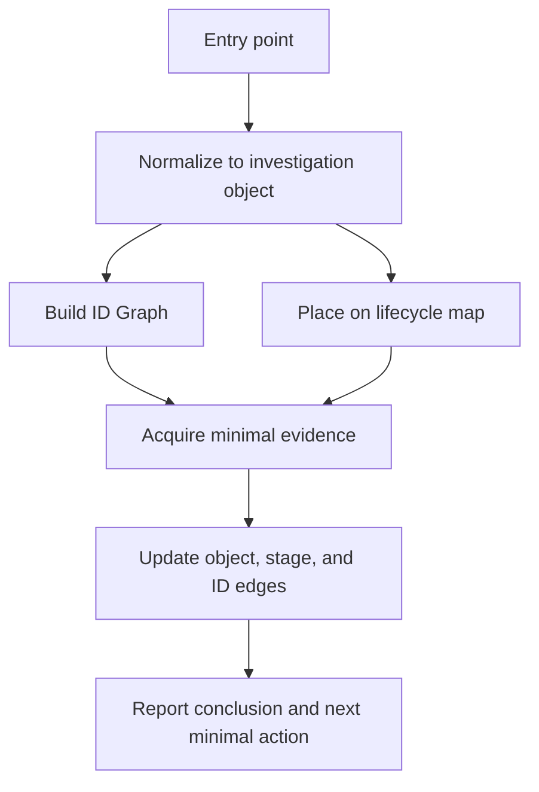

# bk-nodemgr APM Debug

## Overview

Use this skill for bk-nodemgr APM/debug investigation. The core is not fixed tool syntax; the core is a project-specific investigation lens:

- Normalize the user's entry point into investigation objects.
- Use an ID Graph to discover verified next hops.
- Use the request lifecycle map to locate the layer under investigation.
- Dynamically discover available evidence providers such as `gcx/Grafana` or `BlueKing Monitor MCP`.
- Acquire the smallest read-only evidence that distinguishes the next hypothesis.
- Report the conclusion, evidence, ID chain, breakpoints, and next minimal action.

Tools are evidence acquisition channels. Do not turn this skill into a `gcx` or BlueKing Monitor MCP command manual.

## When To Use

Use this skill when the user asks about bk-nodemgr runtime/debug evidence such as:

- `trace_id`, `span_id`, `request_id`, `message_id`, or `TraceId`.
- API latency, errors, timeouts, unavailable service, or abnormal status codes.
- `workflow_id`, `trigger_id`, `operation_id`, `operation_instance_id`, or `oper_inst_id`.
- `task_id`, especially when its source system must be identified.
- `bk_biz_id`, `bk_host_id`, `bk_agent_id`, `plugin_name`, `pkg_name`, `deploy_policy_id`, or `config_policy_id`.
- APM, trace, span, call chain, or runtime evidence investigation.
- Choosing between `gcx/Grafana` and `BlueKing Monitor MCP` for evidence.
- Explaining one request, workflow, action, plugin task, service path, or dependency call from a bk-nodemgr domain perspective.

## When Not To Use

Do not use this skill for:

- Generic Grafana/APM investigations unrelated to bk-nodemgr domain behavior.
- Changing sampling, alert rules, dashboards, deployment, credentials, or service configuration.
- Implementing or modifying bk-nodemgr code.
- Pure Node Manager API Gateway request construction; use `bk-nodemgr-api-debug`.
- Pure Go tracing/logging code review; use the matching Go or bk-nodemgr code skill.
- Broad observability scans without a target object, environment, time window, or convergent entry point.

## Debug Lens

Start every investigation by answering four questions:

1. What is the entry point: ID, API, workflow, business object, service, dependency, alert, or symptom?
2. What is the `primary_object`?
3. Where is the investigation currently placed on the lifecycle map?
4. What will the next evidence query distinguish?

### Design Tree



### Investigation Objects

Normalize all entries into one or more investigation objects, then choose one `primary_object`.

| Object            | Meaning                                                               |
| ----------------- | --------------------------------------------------------------------- |
| `request`         | One HTTP/API call, trace, or request-level symptom                    |
| `workflow`        | Node, plugin, package, or deploy policy workflow                      |
| `operation`       | Workflow runtime operation, action, or operation instance             |
| `business_object` | Host, plugin, policy, package, network area, or similar domain object |
| `service`         | `application`, `backend`, `file`, `relay`, or a third-party service   |
| `dependency`      | bklogin, CMDB, GSE, IAM, Mongo, Redis, job, or another dependency     |
| `transfer_task`   | File service transfer `task_id` or another non-workflow task          |

Choose the object closest to the observed failure as `primary_object`. If evidence shows the real failure is elsewhere, switch `primary_object` and record why.

Examples:

- If the user gives `request_id` but the API only starts an async workflow and the failure happens in an action, switch from `request` to `workflow` or `operation`.
- If the user gives `plugin_name` and `bk_host_id` but evidence shows GSE task failure, switch from `business_object` to `dependency:GSE` and stop at the dependency boundary unless the user asks for deeper external-system debugging.

## ID Graph

bk-nodemgr has many IDs that can be correlated. Use an ID Graph explicitly; do not investigate one ID in isolation.

### ID Classes

This is a seed index, not a permanent exhaustive truth. Verify against the current repo, API docs, logs, span attributes, or runtime data when exact behavior matters.

| Class           | Common IDs                                                                                                                 |
| --------------- | -------------------------------------------------------------------------------------------------------------------------- |
| `request_trace` | `request_id`, `message_id`, `TraceId`, `trace-id`, `span-id`, `traceparent`                                                |
| `workflow`      | `workflow_id`, `trigger_id`, `operation_id`, `operation_instance_id`, `oper_inst_id`, `action_name`, `task_id`             |
| `business`      | `bk_biz_id`, `bk_host_id`, `bk_agent_id`, `plugin_name`, `pkg_name`, `config_policy_id`, `deploy_policy_id`, `instance_id` |
| `resource`      | `bk_cloud_id`, `bk_networkarea_id`, `bk_networkunit_id`, `accesspoint_id`                                                  |
| `auth_user`     | `tenant_id`, `bk_username`, `login_name`, `operator`, `user`, `username`                                                   |

### ID Handling Rules

- Do not guess from ID format alone.
- If the user provides a bare ID, classify it by surrounding context first.
- If an ID name is overloaded, mark it as `ambiguous` and seek minimal evidence to identify its source.
- `task_id` must be source-qualified. It may belong to file transfer, GSE, or another external system.
- Prefer verified field names from API responses, logs, span attributes, docs, or code.
- Preserve exact ID spelling. `trace-id` is not the same as `trace_id`.

### Evidence Levels

Every ID edge in the report should have an evidence level.

| Level       | Meaning                                                                                        |
| ----------- | ---------------------------------------------------------------------------------------------- |
| `verified`  | Directly observed in runtime data: trace, span, log, API, workflow query, DAO, or API response |
| `derived`   | Derived from a known code rule or stable propagation rule                                      |
| `candidate` | Plausible by field name or context but not yet verified                                        |
| `ambiguous` | ID cannot be safely classified from available evidence                                         |

### ID Correlation Chain

Default reports must include a concise `ID correlation chain`. Include only IDs used in this investigation or needed as next hops.

| ID                      | Layer            | Source              | Evidence   | Next Hop                            |
| ----------------------- | ---------------- | ------------------- | ---------- | ----------------------------------- |
| `request_id`            | request          | API response        | `verified` | logs, `message_id`, response header |
| `message_id`            | request/context  | context propagation | `derived`  | logs, span attributes               |
| `workflow_id`           | workflow         | API response        | `verified` | workflow query                      |
| `trigger_id`            | workflow runtime | workflow record     | `verified` | operation/action spans              |
| `operation_instance_id` | operation        | workflow runtime    | `verified` | action logs/spans                   |

## Lifecycle Map

The lifecycle map is a navigation map, not a mandatory checklist. Do not sweep all stages by default. Choose the shortest path from the `primary_object`, then expand adjacent stages only when evidence requires it.

Candidate stages:

1. **Ingress/API**
   - Route, method, status, request body shape, response body, `request_id`, `TraceId`.
2. **Auth/Tenant/User**
   - `tenant_id`, `X-Bk-Tenant-Id`, `bk_username`, `login_name`, `operator`.
3. **Application Gateway Role**
   - Whether `application` only forwards or aggregates, and whether context propagates downstream.
4. **Backend Orchestration Role**
   - Business service logic, object validation, workflow/task creation, third-party client calls.
5. **Workflow/Async Runtime**
   - `workflow_id -> trigger_id -> operation_id / operation_instance_id`, action execution, retries, final state.
6. **Storage/DAO**
   - Mongo/Redis access, tenant collection, query latency, missing records, storage errors.
7. **Thirdparty/Infra Boundary**
   - bklogin, CMDB, GSE, IAM, job, file/relay, network/resource boundaries.

`Application Gateway Role` and `Backend Orchestration Role` are service roles, not guaranteed stages for every request.

## Evidence Acquisition

`gcx/Grafana` and `BlueKing Monitor MCP` are peer evidence providers. Do not hardcode a global priority. Choose the provider by:

- Environment/context coverage.
- Available datasource or app.
- Whether the input ID appears in that provider.
- Whether the provider can answer the current distinction with lower cost.
- Whether the provider returns trace, span, logs, metrics, or workflow evidence at the needed granularity.

### Dynamic Discovery Protocol

Before remote evidence queries:

1. Identify `environment/context`.
2. Identify the target object and ID.
3. Identify the time window.
4. Discover available provider, tool, datasource, app, and fields.
5. Choose the smallest read-only query.
6. State: `This query distinguishes ...`
7. Run the query with narrow filters and a small limit.
8. Record no-data as no matching data in this scope/window, not as health.

### Default Context and Time Window

If the user omits context/environment:

- You may read current context from the appropriate tool.
- Before remote query, explicitly state which context will be used.
- If environment materially affects the answer, ask one precise question instead of guessing.

If the user omits time window:

| Entry           | Default                                          |
| --------------- | ------------------------------------------------ |
| request/trace   | last `6h`                                        |
| workflow/task   | last `24h`                                       |
| business object | require user-provided or evidence-derived window |
| alert/symptom   | use alert timestamps or ask for incident window  |

Always report assumed windows. If no data is found, say it was not found in the assumed window, not that it does not exist.

### Query Budget

Default query budget:

- Before each remote query, write one sentence: `This query distinguishes ...`
- Initial phase: at most one context/environment confirmation and one main target lookup.
- Each round: at most one main signal and one auxiliary signal.
- Default `limit <= 20`.
- Use aggregation only when answering impact, scope, share, or prevalence.
- Do not perform inventory dumps.
- Do not fetch all logs, all traces, all services, or unbounded time ranges.
- Keep all remote actions read-only.

### Provider Notes

When using `gcx/Grafana`:

- Load and follow `gcx` and `debug-with-grafana`.
- Verify context before querying.
- Discover datasource/app instead of assuming the first result.
- Prefer trace-friendly compact output when available.
- Use fixed context flags rather than changing global state when possible.

When using `BlueKing Monitor MCP`:

- Dynamically inspect available MCP tools and schemas.
- Prefer exact `bk_biz_id`, `app_name`, service, time window, and ID filters.
- Do not assume MCP tool names or schemas are stable.
- Do not call broad searches when an ID-specific lookup is possible.

When Node Manager API/workflow state must be queried:

- Use `bk-nodemgr-api-debug`.
- This skill decides why and what to query.
- `bk-nodemgr-api-debug` owns API Gateway/bk-cli payload and response handling details.

## Investigation Flow

Use this flow unless the user asks only for a narrow fact.

1. **Frame**
   - Restate symptom, environment/context, window, and given IDs.
   - If context or window is missing, apply defaults only when safe and report assumptions.
2. **Normalize**
   - Convert inputs into investigation objects.
   - Select `primary_object`.
   - List secondary objects.
3. **Classify IDs**
   - Put each known ID into an ID class.
   - Mark ambiguous IDs.
   - Identify possible next hops.
4. **Place on Lifecycle Map**
   - Choose the most relevant lifecycle stage.
   - Do not sweep unrelated stages.
5. **Acquire Minimal Evidence**
   - Pick one provider/tool path.
   - State what the query distinguishes.
   - Run the smallest read-only query.
   - Record provider limitations and no-data scope.
6. **Update ID Graph**
   - Add verified/derived/candidate edges.
   - If `primary_object` changes, record why.
7. **Decide**
   - Classify result as `confirmed`, `likely`, or `inconclusive`.
   - Check material alternatives only when they could change the answer.
8. **Report**
   - Lead with conclusion.
   - Include ID chain, evidence, ruled-out paths, uncertainty, and next minimal action.

## Output Contract

Default report format:

```markdown
**结论**
`confirmed | likely | inconclusive`: <one-sentence answer>

**调查对象**
primary_object: `<type>`
secondary_objects: `<type list>`
primary_object_changes: `<none or reason>`

**生命周期位置**
<Ingress/API | Auth/Tenant/User | Application Gateway Role | Backend Orchestration Role | Workflow/Async Runtime | Storage/DAO | Thirdparty/Infra Boundary>

**ID 关联链**

| ID  | 层级 | 来源 | 证据等级                             | 下一跳 |
| --- | ---- | ---- | ------------------------------------ | ------ |
| ... | ...  | ...  | verified/derived/candidate/ambiguous | ...    |

**关键证据**

| Evidence | Source | Meaning |
| -------- | ------ | ------- |
| ...      | ...    | ...     |

**已排除**

- <checked direction that did not support the hypothesis>

**断点 / 不确定性**

- <missing window/context/provider/no-data/ambiguous ID>

**下一步最小动作**

- <one next action, only if useful>
```

### Conclusion Levels

Use strict conclusion levels:

| Level          | Definition                                                                                                                          |
| -------------- | ----------------------------------------------------------------------------------------------------------------------------------- |
| `confirmed`    | Direct runtime evidence supports the conclusion, and key alternative explanations are excluded or irrelevant to the user's question |
| `likely`       | Evidence consistently points to a layer, dependency, or object, but one key verification is still missing                           |
| `inconclusive` | ID chain, time window, environment, provider availability, or evidence quality cannot support a causal conclusion                   |

Do not label a suspect as `confirmed` just because it is the slowest visible span.

## Common Mistakes / Hard Stops

Hard stops:

- Do not treat `workflow_id` as a trace ID.
- Do not treat API success as workflow completion.
- Do not treat `task_id` as workflow task without source qualification.
- Do not treat APM/Tempo no-data as system health.
- Do not infer root cause from one slow span unless the user only asks about that exact request.
- Do not run remote APM/log queries without environment/context and time window.
- Do not change sampling, alert rules, dashboards, deployment, credentials, or service config.
- Do not expand external dependency debugging indefinitely; stop at the boundary and report next evidence.
- Do not select the first datasource/app/tool result without checking it matches scope.
- Do not collapse `request_id`, `message_id`, `TraceId`, `trace-id`, and `span-id` into one concept.
- Do not assume `plugin_id`, `package_id`, or `config_id` are primary bk-nodemgr fields when the current API/domain uses `plugin_name`, `pkg_name`, or `config_policy_id`.

Common mistakes:

- Querying every signal instead of asking what the next query distinguishes.
- Reporting not found without the searched context, app, datasource, and time window.
- Forgetting deploy policy parent/child workflow split.
- Following service topology instead of the specific investigation object.
- Copying tool output without turning it into ID graph and lifecycle position.

## Related Skills

Use related skills by responsibility:

- `bk-nodemgr-api-debug`: Node Manager API Gateway, bk-cli calls, workflow/API status queries, request payload construction.
- `gcx`: gcx context, datasource discovery, Grafana resources and trace/log/metric commands.
- `debug-with-grafana`: Grafana investigation workflow, trace comparison, metrics/logs/traces evidence discipline.
- `bk-nodemgr-contextx`: tenant/user/message propagation through `contextx`.
- `bk-nodemgr-logger`: logger fields, `trace-id`, `span-id`, structured log semantics.
- `bk-nodemgr-error-handling`: Go error propagation semantics when code-level diagnosis is needed.
- `bk-nodemgr-architecture-judgment`: cross-layer boundary review if the investigation reveals architectural drift.

This skill orchestrates those skills. Do not copy their command details unless needed for the current investigation.

## Reference Facts

Keep these facts short and verify against the current repo when exact behavior matters:

- REST `request_id` enters `contextx.MessageID()`.
- Logs use hyphen keys `trace-id` and `span-id`.
- HTTP response header exposes `TraceId`.
- Workflow runtime commonly follows `workflow_id -> trigger_id -> operation_id / operation_instance_id`.
- Async workflow task propagation carries `trace-id` and `span-id`.
- `task_id` must be source-qualified; file transfer and GSE tasks are not interchangeable.
- Deploy policy has parent workflow and child workflows; parent `workflow_id` alone does not prove child completion.
- Plugin/package/config paths commonly use `plugin_name`, `pkg_name`, and `config_policy_id`; do not default to `plugin_id`, `package_id`, or `config_id`.
