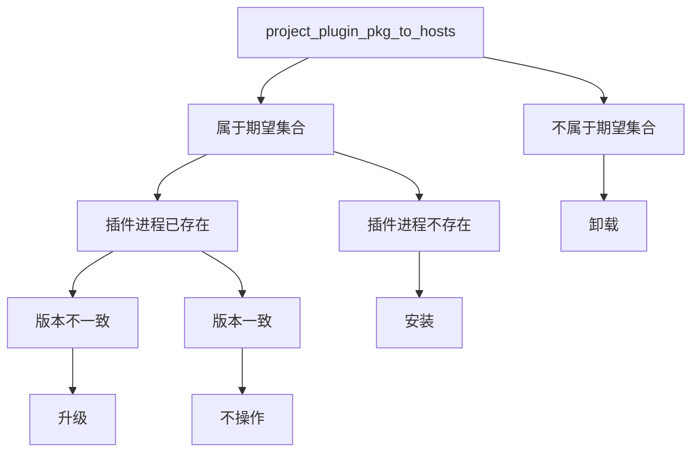

## spec

spec 定义了期望的最终状态，用于指定目标最终应达到的状态。

### specify_plugin

指定插件版本，确保目标主机上安装指定名称和版本的插件。如果插件不存在则安装，版本不匹配则升级。

### specify_plugin_sub_config

指定插件子配置，用于更新已安装插件的配置文件内容。仅更新配置，不涉及插件版本的安装或升级。

### specify_plugin_sub_config_template

指定插件子配置模板，用于按配置模板为已安装插件生成 deploy-policy 管理的子配置文件。仅更新配置，不涉及插件版本的安装或升级。

对每一个 scope target，系统都应为已存在的 `plugin_name` 对应插件进程声明缺失的子配置文件。配置文件名称根据模板名和部署策略 ID 自动生成：`{base_name}_deploy_{deploy_policy_id}{ext}`。

该 spec 表达的是 `scope targets × template items` 的声明式期望状态：期望存在但实际不存在时创建，已存在时不重复创建。`plugin_name` 表示被声明配置的已安装插件；它不是插件安装声明。

### specify_plugin_pkg

指定插件包版本，确保目标主机/服务实例上安装指定插件包名称和版本的插件。插件名称会根据部署策略 ID 和模块 ID 自动生成。如果插件不存在则安装，版本不匹配则升级。

### specify_plugin_pkg_sub_config

指定插件包子配置，用于更新已安装插件包的配置文件内容。仅更新配置，不涉及插件包版本的安装或升级。插件名称会根据部署策略 ID 和模块 ID 自动生成。

### project_plugin_pkg_to_hosts

投射插件包实例到指定承载主机。scope 计算出的目标主机/服务实例只作为 remote target，用于派生插件实例身份；插件进程实际运行在 spec 参数 `placement_host_ids` 指定的承载主机上。

对每一个 scope remote target 和每一个 `placement_host_id`，系统都应确保承载主机上存在一个对应插件进程。插件名称根据插件包名、部署策略 ID、remote target 的模块 ID 和 remote target 的主机 ID 自动生成：`{plugin_pkg_name}_{deploy_policy_id}_{remote_module_id}_{remote_host_id}`。当 remote target 是主机粒度时，`remote_module_id` 保持现有 scope target 的零值语义，即 `0`。

该 spec 表达的是 `scope remote targets × placement_host_ids` 的声明式期望状态：期望存在但实际不存在时安装，版本不匹配时升级，实际存在但不再属于期望集合时卸载。`placement_host_ids` 是承载位置，不是第二套 scope，也不表达调度、分片、主备角色或按主机差异化配置。

#### 对象角色

| 对象                  | 作用                                        |
| --------------------- | ------------------------------------------- |
| `scope remote target` | 派生插件实例身份                            |
| `placement_host_id`   | 指定插件进程运行的承载主机                  |
| 期望集合              | `scope remote targets × placement_host_ids` |

#### 收敛规则

| 条件                         | 收敛动作 |
| ---------------------------- | -------- |
| 期望插件进程不存在           | 安装     |
| 期望插件进程存在但版本不一致 | 升级     |
| 期望插件进程存在且版本一致   | 不操作   |
| 运行中插件进程不属于期望集合 | 卸载     |

#### 决策树

#### 边界说明

- `scope remote target` 只用于派生插件实例身份，不表示插件进程运行位置。
- `placement_host_id` 只表示承载主机，不改变 remote target 的身份。
- 插件名称仍按 `{plugin_pkg_name}_{deploy_policy_id}_{remote_module_id}_{remote_host_id}` 生成。
- 当 remote target 是主机粒度时，`remote_module_id` 使用 `0`。

### project_plugin_config_template_to_hosts

投射配置模板到指定插件所在主机。scope 计算出的目标主机/服务实例作为 source target，用于派生配置文件身份；配置文件实际声明到已存在的 `plugin_name` 对应插件进程所在主机上。该 spec 只管理配置文件，不安装插件、不升级插件，也不选择插件包或插件版本。

对每一个 scope source target，系统都应为每一个通过 `plugin_name` 反向定位到的插件进程声明一个对应的子配置文件。配置文件来自同一个配置模板，且配置文件名称根据配置模板名、部署策略 ID、source target 的模块 ID 和 source target 的主机 ID 自动生成：`{base_name}_deploy_{deploy_policy_id}_{source_module_id}_{source_host_id}{ext}`。当 source target 是主机粒度时，`source_module_id` 保持现有 scope target 的零值语义，即 `0`。

该 spec 表达的是 `scope source targets × plugin_name matched hosts` 的声明式期望状态：期望存在但实际不存在时创建，实际存在但不再属于期望集合时删除。`plugin_name` 同时表示被声明配置的插件，以及用于反向定位配置承载主机的条件；它不是插件安装声明。
