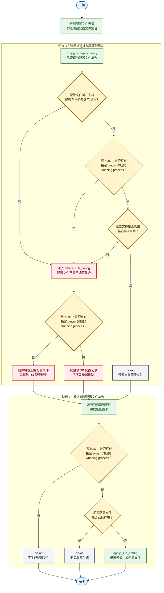

## specify_plugin_sub_config_template

`SpecifyPluginSubConfigTemplate` 根据用户指定的配置文件模板，为指定插件生成 deploy-policy 管理的子配置文件。

该 spec 只声明配置文件的期望状态，不负责安装插件、升级插件或启动插件。`plugin_name` 是用户指定的配置承载插件；plugin 落地到 host 后由 process 表达，所以运行态判断发生在该 host 上 `plugin_name` 对应的 process。只有当前部署范围内存在该 Running process，才会生成或保留对应配置文件。

### 决策输入

| 输入                 | 含义                                      |
| -------------------- | ----------------------------------------- |
| `deploy scope`       | 当前部署策略计算出的目标范围              |
| `plugin_name`        | 用户指定的配置承载插件                    |
| `config template`    | 用户指定的配置文件模板                    |
| `managed config set` | 当前 deploy policy 已管理的子配置文件集合 |

### 决策树



### 边界规则

| 场景                                                                                 | 决策                     |
| ------------------------------------------------------------------------------------ | ------------------------ |
| 当前部署范围内存在指定 plugin 对应的 Running process，且模板声明的配置文件不存在     | 生成配置文件             |
| 当前部署范围内存在指定 plugin 对应的 Running process，且配置文件已存在并仍由模板声明 | 保留配置文件，不重复生成 |
| host 上不存在指定 plugin 对应的 Running process                                      | 删除 DB 配置记录         |
| `managed config set` 中存在不在当前 `deploy scope` 内的插件配置文件                  | 进入删除分支             |
| `managed config set` 中存在当前模板不再声明的配置文件                                | 进入删除分支             |

### 删除分支

| 条件                                                                   | 行为                                     |
| ---------------------------------------------------------------------- | ---------------------------------------- |
| 需要删除配置文件，且该 host 上存在指定 plugin 对应的 Running process   | 删除机器上的配置文件，再删除 DB 配置记录 |
| 需要删除配置文件，但该 host 上不存在指定 plugin 对应的 Running process | 仅删除 DB 配置记录，不下发机器删除       |

### 结果语义

`SpecifyPluginSubConfigTemplate` 的收敛目标是：

```text
expected config files = Running process for specified plugin in deploy scope × config template items
```

任何不属于该集合、但仍在当前 deploy policy 管理集合中的子配置文件，都应被删除。
