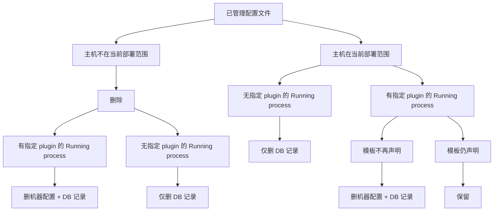
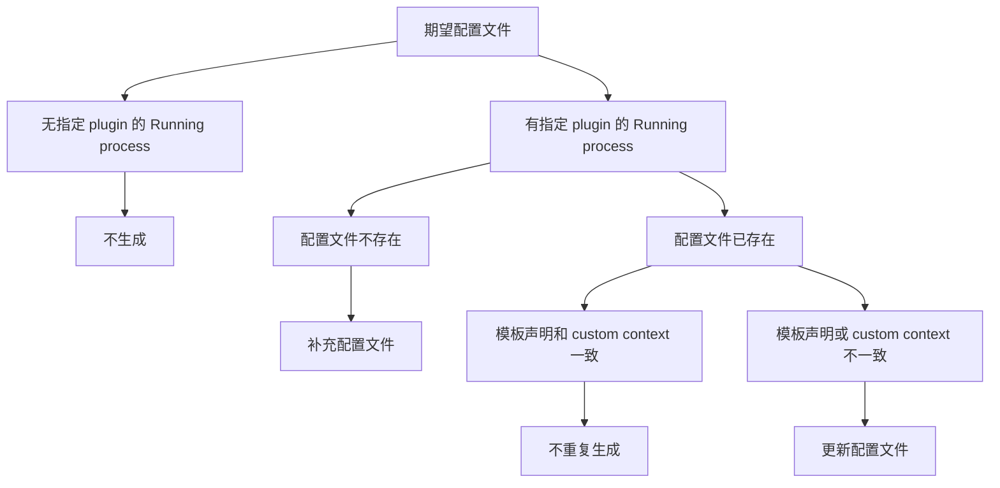

## specify_plugin_sub_config_template

`SpecifyPluginSubConfigTemplate` 根据用户指定的配置文件模板，为指定插件生成 deploy-policy 管理的子配置文件。

该 spec 只声明配置文件的期望状态，不负责安装插件、升级插件或启动插件。`plugin_name` 是用户指定的配置承载插件；plugin 落地到 host 后由 process 表达，所以运行态判断发生在该 host 上 `plugin_name` 对应的 process。只有当前部署范围内存在该 Running process，才会生成或保留对应配置文件。

### 决策输入

| 输入                 | 含义                                      |
| -------------------- | ----------------------------------------- |
| `deploy scope`       | 当前部署策略计算出的目标范围              |
| `plugin_name`        | 用户指定的配置承载插件                    |
| `config template`    | 用户指定的配置文件模板                    |
| `managed config set` | 当前 deploy policy 已管理的子配置文件集合 |

### 决策树

`SpecifyPluginSubConfigTemplate` 会触发两轮决策。第一轮遍历 `managed config set`，只判断是否需要移除；第二轮遍历期望配置文件，只判断是否需要补充或更新。

#### 第一轮：移除决策



#### 第二轮：补充或更新决策



### 边界规则

| 场景                                                                                                         | 决策             |
| ------------------------------------------------------------------------------------------------------------ | ---------------- |
| 第一轮：`managed config set` 中存在不在当前 `deploy scope` 内的配置文件                                      | 进入删除分支     |
| 第一轮：`managed config set` 中存在 host 上无指定 plugin 对应 Running process 的配置文件                     | 删除 DB 配置记录 |
| 第一轮：`managed config set` 中存在当前模板不再声明的配置文件                                                | 进入删除分支     |
| 第一轮：`managed config set` 中配置文件属于当前 `deploy scope`、存在 Running process 且仍由模板声明          | 保留配置文件     |
| 第二轮：期望配置文件所在 host 上无指定 plugin 对应的 Running process                                         | 不生成配置文件   |
| 第二轮：期望配置文件所在 host 上存在指定 plugin 对应的 Running process，且配置文件不存在                     | 补充配置文件     |
| 第二轮：期望配置文件所在 host 上存在指定 plugin 对应的 Running process，且模板声明和 `custom context` 一致   | 不重复生成       |
| 第二轮：期望配置文件所在 host 上存在指定 plugin 对应的 Running process，且模板声明或 `custom context` 不一致 | 更新配置文件     |

### 删除分支

| 条件                                                                   | 行为                                     |
| ---------------------------------------------------------------------- | ---------------------------------------- |
| 需要删除配置文件，且该 host 上存在指定 plugin 对应的 Running process   | 删除机器上的配置文件，再删除 DB 配置记录 |
| 需要删除配置文件，但该 host 上不存在指定 plugin 对应的 Running process | 仅删除 DB 配置记录，不下发机器删除       |

### 结果语义

`SpecifyPluginSubConfigTemplate` 的收敛目标是：

```text
expected config files = Running process for specified plugin in deploy scope × config template items
```

任何不属于该集合、但仍在当前 deploy policy 管理集合中的子配置文件，都应被删除。
