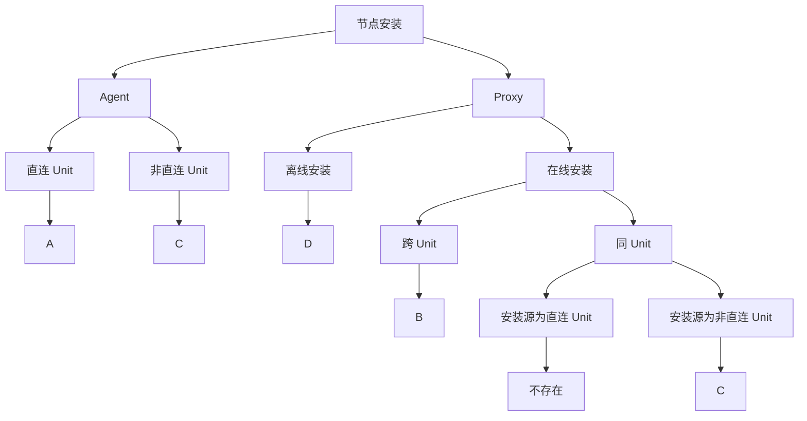
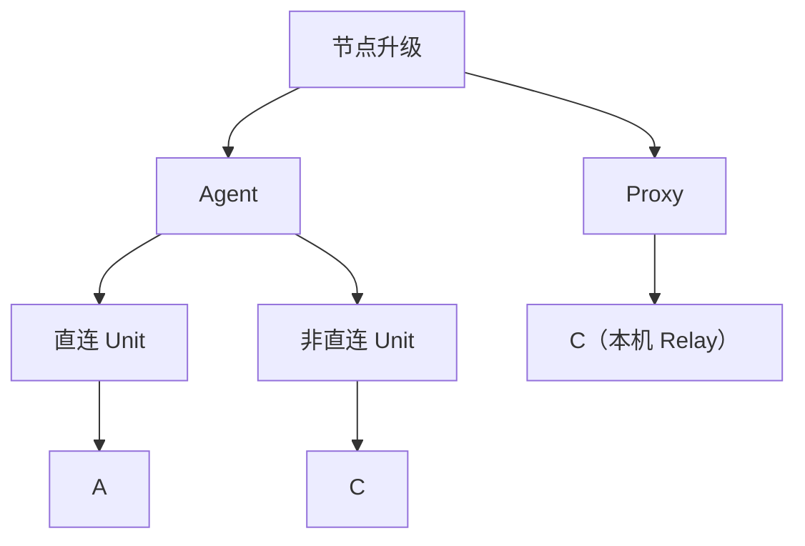
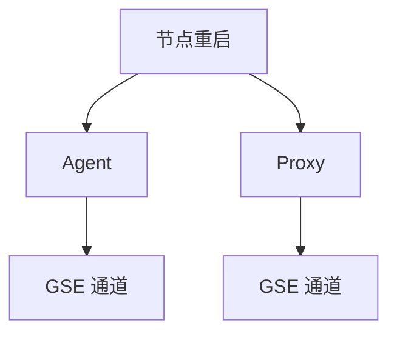

## 节点操作：传输模式与状态回写

节点安装/升级过程中，`installer` 需要获取安装包并回写执行状态。根据目标节点所在 [**Network Unit（ 管控单元）
**](../topo/networkunit.md)
拓扑与节点角色，系统会选择不同的传输与回写通道。

## 传输模式

| 模式               | 文件传输                                  | 状态回写                          | 说明                                                              |
|------------------|---------------------------------------|-------------------------------|-----------------------------------------------------------------|
| **A. Server 直连** | 目标节点从 File `download` 拉取              | 目标节点向 Backend `callback` 上报   | 直连管控单元内，目标节点可直接访问 Server                                        |
| **B. SSH 通道**    | Backend 经 SSH/SFTP 推送                 | Backend 经 SSH 轮询本地状态文件        | 跨管控单元 Proxy 安装；`installer` 使用 `--skip_download --skip_callback` |
| **C. Relay 中转**  | 目标节点从 Proxy 上 Relay 插件的 `download` 拉取 | 目标节点向 Relay 插件的 `callback` 上报 | 非直连管控单元；Relay 经 GSE 信令与 Server 通信                               |
| **D. 离线安装**      | 管理员手动下载离线包                            | 管理员手动执行并在完成后回写状态              | 仅 Proxy 安装；目标环境无法访问管控面网络                                        |

> **区分 orchestration 与传输模式**：自动安装时 Backend 可能通过 SSH/WMI 登录目标主机并下发命令，但这只决定**如何触发**
`installer`；上表描述的是 `installer` 运行时**如何获取文件、如何回写状态**。

## 决策规则

### 节点安装

#### Agent 安装

| 条件                              | 传输模式 |
|---------------------------------|------|
| 目标 Unit 为直连（`is_direct = true`） | A    |
| 目标 Unit 为非直连                    | C    |

#### Proxy 安装

| 条件                                                        | 传输模式 |
|-----------------------------------------------------------|------|
| 离线安装（`is_offline = true`）                                 | D    |
| 跨管控单元（`proxy_install_origin_unit_id ≠ bk_networkunit_id`） | B    |
| 同管控单元 + 安装源 Unit 为直连                                      | 不存在  |
| 同管控单元 + 安装源 Unit 为非直连                                     | C    |

#### 决策树

#### 边界说明

- **手动安装**（`is_manual = true`）：Backend 生成 bootstrap 命令供管理员手动执行；传输模式仍按上表选择 A 或 C 的
  `--dlsvr_addr` / `--cbsvr_addr`，不由 Backend 自动推送。
- **跨 Unit Proxy + B 模式**：Backend 预渲染配置文件与 checklist，经 SFTP 推送至目标；安装完成后通过 SSH 轮询
  `installer.status.json` 获取结果。
- **非直连 Unit 插件安装**：Callback 走 Relay；Download 端点为空时跳过在线下载（与节点安装 C 模式一致）。

### 节点升级

升级与安装的传输机制不同：**安装包一律经 GSE 文件通道推送**（`transfer_pkg_to_node`），`installer` 升级时默认
`--skip_download`，不再从 `download` 端点拉取。A/C 在此节主要指**状态回写通道**。

#### Agent 升级

| 条件                                                | 文件传输                                          | 状态回写                  | 传输模式 |
|---------------------------------------------------|-----------------------------------------------|-----------------------|------|
| 目标 Unit 为直连（`upgrade_options.direct_link = true`） | GSE 文件通道推送 release 包                          | Backend `callback`    | A    |
| 目标 Unit 为非直连                                      | 先 `ensure_pkg_to_relay` 同步至 Relay，再 GSE 推送至目标 | 所选 Relay 的 `callback` | C    |

workflow 选择见 `getUpgradeOperationDef`：直连走 `upgrade_node`，非直连走 `upgrade_pagent`。

#### Proxy 升级

| 条件               | 文件传输                 | 状态回写                                                                  | 传输模式        |
|------------------|----------------------|-----------------------------------------------------------------------|-------------|
| 任意 Unit（不区分是否直连） | GSE 文件通道推送 release 包 | 本 Proxy 自身 Relay 的 `callback`（首个 `inner_ip:relay_callback_port`） | C（本机 Relay） |

Proxy 升级固定走 `upgrade_proxy` workflow，回调地址取自身首个 `inner_ip` + `RelayCallbackPort`，与目标 Unit 的
`is_direct` 无关。Proxy `inner_ip` 的首位规则见 [Host（主机）](host.md)。

#### 决策树

#### 边界说明

- **文件传输与安装的差异**：升级前由 `transfer_pkg_to_node` 经 GSE 下发 release 包；非直连 Agent 额外执行
  `ensure_pkg_to_relay`，将包同步到 Relay 所在 Proxy。
- **installer 不拉包**：`upgrade_node` 固定 `SkipDownload: true`；`upgrade_pagent` 虽注入 Relay 的 `--dlsvr_addr`，但
  release 已由前置步骤推送，installer 仅执行升级脚本。
- **触发方式**：升级命令经 GSE `ExecuteScript` 下发，不经 SSH 登录目标机。
- **非直连 Agent 的 installer 传输**：`enablePagentInstaller` 会为非直连 Agent 额外经 GSE 传输 installer 工具（
  `transfer_options.enable_installer = true`）。

### 节点重载

重载（reconfig）会触发 `installer` 重新渲染配置并回写执行状态。A/C 在此节主要指**状态回写通道**；installer 工具经 GSE
文件通道推送（`transfer_pkg_to_node`），不涉及 HTTP `download`。

#### Agent 重载

| 条件                                                 | 状态回写                  | 传输模式 |
|----------------------------------------------------|-----------------------|------|
| 目标 Unit 为直连（`reconfig_options.direct_link = true`） | Backend `callback`    | A    |
| 目标 Unit 为非直连                                       | 所选 Relay 的 `callback` | C    |

workflow 选择：直连走 `reconfig_node`，非直连走 `reconfig_pagent`。

#### Proxy 重载

| 条件               | 状态回写                                                    | 传输模式        |
|------------------|---------------------------------------------------------|-------------|
| 任意 Unit（不区分是否直连） | 本 Proxy 自身 Relay 的 `callback`（首个 `inner_ip:relay_callback_port`） | C（本机 Relay） |

非直连单元默认无法直连管控面（见 [管控单元](../topo/networkunit.md)）；Proxy 作为单元内 Relay 载体，状态回写经本机 Relay
中转，与 Proxy 升级一致。Proxy `inner_ip` 的首位规则见 [Host（主机）](host.md)。

#### 决策树

### 节点重启

重启（restart）**不适用** A/B/C/D 传输模式：`installer` 仅执行 restart 步骤，不注入 `--cbsvr_addr` / `--dlsvr_addr`；结果由
`wait_gse_ready` 轮询 GSE Agent 状态确认。

#### Agent 重启

| 条件               | 文件传输                | 结果确认           |
|------------------|---------------------|----------------|
| 任意 Unit（不区分是否直连） | GSE 推送 installer 工具 | GSE Agent 状态轮询 |

#### Proxy 重启

| 条件               | 文件传输                | 结果确认           |
|------------------|---------------------|----------------|
| 任意 Unit（不区分是否直连） | GSE 推送 installer 工具 | GSE Agent 状态轮询 |

Agent / Proxy 均固定走 `restart_node` workflow；Agent 在版本支持时优先经 GSE `OperateAgent` 软重启，否则经 GSE
`ExecuteScript` 执行 restart 脚本。

#### 决策树

## 相关文档

- [Host（主机）](host.md)
- [架构设计 — Relay 服务](../../operation/architecture.md)
- [Installer 参数说明](../tool/installer_params.md)
