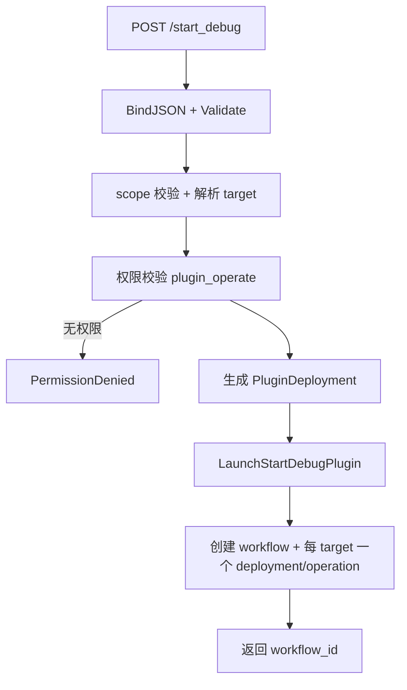
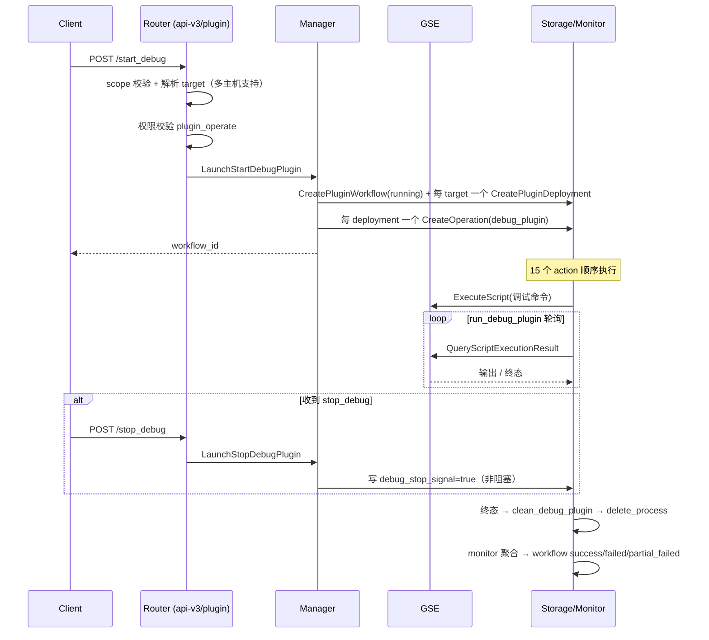

# 插件调试（Plugin Debug）使用手册

## 1. 目标与适用场景

插件调试（`debug_plugin`）在**一台或多台目标主机**上，以**隔离的调试部署**方式运行插件的调试命令，实时流式观察运行输出，并在会话结束后自动清理现场。

适用场景：排查插件启动失败、配置未生效、运行期异常等需要"在真实主机上跑一次看输出"的问题。

与常规操作的本质区别：

| 维度     | Install / Upgrade  | Debug                                                         |
| -------- | ------------------ | ------------------------------------------------------------- |
| 部署     | 作用于目标 process | 独立 `Deployment`（独立 token），与生产 process 隔离          |
| 运行方式 | 按托管配置启动     | 手动执行调试命令，监控策略改为 `manual`                       |
| 生命周期 | 常驻               | 一次性，结束后清理调试目录并删除 process                      |
| 目标数量 | 批量               | 支持多台：scope 解析出的每个 target 各建一个独立 `Deployment` |

术语遵循 [glossary](../glossary.md)：`Plugin`（插件）、`Plugin Package`（插件包）、`Process`（进程）、`Deployment`（部署）。

## 2. 流程结构（workflow → operation → action）

一次 debug 会话 = 1 个 `PluginWorkflow`（`type = debug_plugin`）+ N 个 `operation`（每个目标主机 1 个，均为 `debug_plugin`）+ 每 operation 一串顺序执行的 `action`。

Action 链共 15 步，分三个阶段：

**阶段一：安装准备（复用既有 install 链路）**

| #   | action                                    | 说明                                 |
| --- | ----------------------------------------- | ------------------------------------ |
| 1   | `try_stop_process`                        | 尝试停止目标主机上可能存在的同名进程 |
| 2   | `upsert_process`                          | 落库 process 记录                    |
| 3   | `verify_plugin_availability`              | 校验插件包可用性                     |
| 4   | `inject_plugin_custom_deploy_config`      | 注入自定义部署配置                   |
| 5   | `render_plugin_deployment`                | 渲染部署模型                         |
| 6   | `ensure_and_update_plugin_config_details` | 确保/更新配置详情                    |
| 7   | `render_plugin_config`                    | 渲染配置                             |
| 8   | `transfer_plugin_pkg_to_node`             | 下发插件包                           |
| 9   | `install_plugin`                          | 执行安装                             |
| 10  | `wait_plugin_installer_complete`          | 等待安装完成                         |
| 11  | `push_plugin_config`                      | 推送配置                             |

**阶段二：调试执行**

| #   | action                  | 说明                                                                                                                                |
| --- | ----------------------- | ----------------------------------------------------------------------------------------------------------------------------------- |
| 12  | `prepare_debug_process` | 生成调试启动命令并写入 `Controller.StartCmd`（拼装规则见 [§6](#6-调试指令拼装规则)）；监控策略置 `manual`，`OpTimeoutSecs` 置 `250` |
| 13  | `run_debug_plugin`      | 通过 GSE 执行调试命令，**每秒轮询**：流式输出日志 + 检查 stop 信号 + 检查任务终态；`MaxRetryCount = 0`（不可重试）                  |

**阶段三：清理**

| #   | action               | 说明                                                                               |
| --- | -------------------- | ---------------------------------------------------------------------------------- |
| 14  | `clean_debug_plugin` | 通过 installer `plugin full-debug clean` 清理调试目录（`{run_dir}/debug/{token}`） |
| 15  | `delete_process`     | 删除调试 process                                                                   |

**重试语义**（`RetryStartPoint`）：除 `wait_plugin_installer_complete` 与 `run_debug_plugin` 外均可作为重试起点；`run_debug_plugin` 为流式一次性执行，失败只能整体重跑。

## 3. 权限要求

所有 debug 接口使用权限动作 `plugin_operate`，资源类型 `biz`。

| 接口                         | 校验方式                                                               | 校验对象                                                           |
| ---------------------------- | ---------------------------------------------------------------------- | ------------------------------------------------------------------ |
| `start_debug`                | `authorizedPluginOperate(plugin_name)`                                 | 请求中的 `plugin_name` 必须落在用户已授权 biz 内可见的 plugin 集合 |
| `stop_debug`                 | `authorizer.Check(plugin_operate, BuildBizResources(workflow.BizIDs))` | 按 workflow 关联的 BizIDs 校验                                     |
| 组合日志接口（`workflow/*`） | `authorizedPluginOperate`                                              | 按目标 workflow 的可见性校验                                       |

放行边界：用户对 `plugin_operate` 拥有任意 biz 的授权（`scopeIsAny`）时直接放行；否则必须命中所属 biz。不满足 → `PermissionDenied`。

## 4. API 使用

启动与停止两个接口均为 `POST`，前缀 `/api/v3/plugin`；日志获取复用通用 `workflow` 查询接口（见 [§4.3](#43-获取调试日志组合接口)）。

### 4.1 启动调试 `POST /api/v3/plugin/start_debug`

请求体：

```json
{
  "debug_info": {
    "scope": {
      "granularity": "host",
      "bk_biz_id": 2,
      "instance_ids": [101]
    },
    "plugin_name": "bkmonitorbeat",
    "version": "1.0.0",
    "config_template_name": ["base"],
    "custom_config_context": { "key": "value" }
  }
}
```

| 字段                               | 类型            | 必填 | 约束                                                                                                        |
| ---------------------------------- | --------------- | ---- | ----------------------------------------------------------------------------------------------------------- |
| `debug_info.scope`                 | `ScopeInstance` | ✅   | `granularity` 支持 `host` / `service_instance`；解析出的每个 target 各建一个独立 `Deployment`（多主机支持） |
| `debug_info.plugin_name`           | string          | ✅   | 非空                                                                                                        |
| `debug_info.version`               | string          | ✅   | 非空                                                                                                        |
| `debug_info.config_template_name`  | repeated string | ❌   | 配置模板名                                                                                                  |
| `debug_info.custom_config_context` | object          | ❌   | 自定义配置上下文                                                                                            |

返回：

```json
{ "data": { "workflow_id": "..." } }
```

**决策流程**：



### 4.2 停止调试 `POST /api/v3/plugin/stop_debug`

请求体：`{ "workflow_id": "..." }`

**语义：非阻塞**。接口只向 `run_debug_plugin` action 实例的 private data 写入 `debug_stop_signal = true` 后立即返回；运行中的调试进程由 action 侧感知信号后自行终止，随后进入清理阶段。

前置校验（不满足返回 `Aborted`）：

| 条件                                                                 | 结果 |
| -------------------------------------------------------------------- | ---- |
| workflow 不存在                                                      | 失败 |
| workflow 不是 `debug_plugin` 类型                                    | 失败 |
| workflow 已终态（`IsFinished`：`success`/`failed`/`partial_failed`） | 失败 |
| workflow 下无 operation                                              | 失败 |

### 4.3 获取调试日志（组合接口）

调试日志通过**通用 `workflow` 查询接口组合**获取 —— 与节点管理前端“任务历史”日志查看方式一致。仅凭 `workflow_id` 即可串联出所有主机的 debug 日志。

**调用链（4 步）**：

```
workflow_id
   │
   ▼ ① POST /api/v3/plugin/workflow/list          ← 整体概览
   │    exact_include_conditions.workflow_id=["<workflow_id>"]
   │    items[0]: status / trigger_id / bk_host_id[] / bk_biz_id[] / finish_time
   │
   ▼ ② POST /api/v3/plugin/workflow/operation/list  ← 每台主机一个 operation
   │    workflow_id="<workflow_id>"
   │    operations[]: operation_id / instance_ids[]（取最后一个为最新实例）
   │                  plugin_deployment_info.bk_host_id（对应主机）
   │
   ▼ ③ POST /api/v3/plugin/workflow/operation/instance/list  ← 批量取实例
   │    operation_id=["<operation_id>", ...]
   │    oper_inst_data[]: oper_inst_id / action_names[] / life_cycle.state
   │
   ▼ ④ POST /api/v3/plugin/workflow/operation/instance/log/get  ← 逐实例取日志
       oper_inst_id="<oper_inst_id>"
       oper_inst_logs["run_debug_plugin"].message.logs[]  ← 调试输出
```

**要点**：

| 步骤 | 接口                                  | 关键参数                               | 关键返回                                                                     |
| ---- | ------------------------------------- | -------------------------------------- | ---------------------------------------------------------------------------- |
| ①    | `workflow/list`                       | `exact_include_conditions.workflow_id` | `items[0].status`（整体状态）、`bk_host_id[]`                                |
| ②    | `workflow/operation/list`             | 顶层 `workflow_id`                     | 每主机一个 `operation`；`instance_ids` 取最后一个为最新实例                  |
| ③    | `workflow/operation/instance/list`    | `operation_id`（可批量）               | `oper_inst_id`、`action_names`、`life_cycle.state`                           |
| ④    | `workflow/operation/instance/log/get` | `oper_inst_id`（逐实例调用）           | `oper_inst_logs`（含 `run_debug_plugin` 的流式输出）+ `extra_execution_logs` |

权限：与 debug 接口一致，`plugin_operate` + `biz` 资源（`authorizedPluginOperate`，见 [§3](#3-权限要求)）。

## 5. 日志解读与使用

### 5.1 工作流状态（步骤①的 `items[0].status`）

| 值               | 含义                 | 终态 |
| ---------------- | -------------------- | ---- |
| `running`        | 执行中               | 否   |
| `success`        | 全部 operation 成功  | 是   |
| `failed`         | 全部 operation 失败  | 是   |
| `partial_failed` | 部分主机成功部分失败 | 是   |

### 5.2 调试输出在哪里

调试进程实时输出在步骤④的 `oper_inst_logs["run_debug_plugin"].message.logs[]`，每条含 `time`（Unix 毫秒）、`level`、`text_zh`/`text_en`。

### 5.3 如何判定调试结果

| 观察点                                        | 判定                                                       |
| --------------------------------------------- | ---------------------------------------------------------- |
| `run_debug_plugin.life_cycle.state = success` | 调试命令自然结束                                           |
| `state = timeout`                             | 任务超时（GSE 脚本 250s 上限）被终止                       |
| `state = terminated`                          | 收到 `stop_debug` 信号被终止                               |
| `state = failed`                              | 调试命令执行失败（非零退出码）                             |
| 步骤① `status = success`                      | **整体成功**：安装 + 调试 + 清理全链路完成                 |
| 步骤① `status = failed / partial_failed`      | 按 `action_names` 定位失败 action，读对应 `oper_inst_logs` |

### 5.4 多主机聚合与流式使用

轮询步骤①-④（建议间隔 1-2s）：

0. 多主机时步骤②的 `operations[]` 每个元素对应一台主机，按 `operation_id` 与 `plugin_deployment_info.bk_host_id` 区分，各 operation 独立读取
1. 以 `action_names` 判断当前执行阶段（前 11 步为安装准备，`run_debug_plugin` 为调试输出，后 2 步为清理）
2. 每次读取各 operation 最新实例的 `oper_inst_logs["run_debug_plugin"].message.logs` 增量（按 `time` 游标去重）
3. 直到步骤① `status` 进入终态（`success`/`failed`/`partial_failed`），用 5.3 的规则给出最终结论

### 5.5 Action / Operation 状态枚举（`life_cycle.state`）

| 层        | 枚举                                                                                            |
| --------- | ----------------------------------------------------------------------------------------------- |
| action    | `pending` / `running` / `success` / `failed` / `timeout` / `skipped` / `terminated` / `unknown` |
| operation | `init` / `launched` / `running` / `success` / `failed` / `timeout` / `terminated`               |

## 6. 状态机与边界



| 边界      | 说明                                                                                                                             |
| --------- | -------------------------------------------------------------------------------------------------------------------------------- |
| 多主机    | scope 支持 `host` / `service_instance` granularity；解析出的每个 target 各建一个独立 `Deployment` + `operation`（每台主机 1 个） |
| 调试超时  | GSE 脚本 `OpTimeoutSecs = 250`，超时被杀 → 终态，工作流继续清理（状态记 `success`）                                              |
| stop 语义 | `stop_debug` 只写信号；信号由 `run_debug_plugin` 每秒轮询 private data 感知                                                      |
| 清理      | 调试目录 `{run_dir}/debug/{token}` 由 `clean_debug_plugin` 经 installer `full-debug clean` 删除                                  |
| 隔离性    | debug 使用独立 token 的 deployment，不触碰生产 process 配置                                                                      |

## 7. 调试指令拼装规则

### 7.1 拼装链路

```
插件包 definition.yaml 的 control.debug ──► Process.Controller.DebugCmd（原始调试命令）
      │
      ▼ prepare_debug_process
buildDebugCommand("start", DebugCmd)
      │ 构造 installer.PluginDebugParams + buildArgs
      ▼
完整 `plugin full-debug` 命令 ──► 写入 Process.Controller.StartCmd
      │
      ▼ run_debug_plugin
GSE ExecuteScript(StartCmd, 脚本类型, 250s)
```

### 7.2 指令格式

```
'<installer_path>' plugin full-debug \
  --base_deploy_dir '<v>' --base_work_dir '<v>' --plugin_group '<v>' --plugin_name '<v>' \
  --deploy_env '<v>' --deploy_token '<v>' --oper_inst_id '<v>' \
  --debug_action '<start|clean>' --skip_callback --log_to_std \
  [--run_cmd '<v>'] [--pid_dir '<v>']
```

其中 `<installer_path>` = `{install_work_dir}/installer_{os}_{arch}`（Windows 追加 `.exe`）。

### 7.3 flag 明细

| flag                | 值来源                                 | 何时带          | 说明                              |
| ------------------- | -------------------------------------- | --------------- | --------------------------------- |
| `--base_deploy_dir` | deployment `BaseRuntime.BaseDeployDir` | 恒带            | 基础部署目录                      |
| `--base_work_dir`   | `InstallerRuntime.BaseWorkDir`         | 恒带            | 基础工作目录                      |
| `--plugin_group`    | process                                | 恒带            | 插件分组                          |
| `--plugin_name`     | process                                | 恒带            | 插件名                            |
| `--deploy_env`      | `system.GetEnv()`                      | 恒带            | 部署环境                          |
| `--deploy_token`    | deployment token                       | 恒带            | 部署令牌（会话隔离标识）          |
| `--oper_inst_id`    | 当前 operation instance id             | 恒带            | 绑定本次调试会话                  |
| `--debug_action`    | start / clean                          | 恒带            | 调试动作；clean 触发目录清理      |
| `--skip_callback`   | 恒带（无值 bool）                      | 恒带            | 关闭回调上报，状态写本地文件      |
| `--log_to_std`      | 恒带（无值 bool）                      | 恒带            | 日志同时输出 stdout（供流式抓取） |
| `--run_cmd`         | `Controller.DebugCmd`                  | 仅 start 且非空 | 要执行的原始调试命令              |
| `--pid_dir`         | `{run_dir}/debug/{token}`              | 仅非空          | 调试进程 pid 文件目录             |

### 7.4 引用与转义规则

- 所有带值 flag 的值均用**单引号**包裹；`--skip_callback` / `--log_to_std` 为无值 bool flag。
- Unix：shell 单引号转义（`'` → `'\''`）；Windows：PowerShell 单引号转义（`'` → `''`）。
- 因此 `RunCmd` 即使包含空格或特殊字符也能安全传递；`'` 会被自动转义，请求层无需也无法干预。

### 7.5 installer 侧解析（`plugin full-debug`）

| 项                    | 规则                                                                          |
| --------------------- | ----------------------------------------------------------------------------- |
| 必填 flag             | `--deploy_token`、`--oper_inst_id`、`--debug_action`                          |
| 可选 flag             | `--run_cmd`、`--pid_dir`、`--log_dir`、`--log_to_std`、`--skip_callback`      |
| `--callback_svr_addr` | 仅当未设 `--skip_callback` 时必填；本流程恒带 `--skip_callback`，无需回调服务 |
| `--debug_action` 取值 | `start`（执行 `--run_cmd`）/ `stop` / `clean`（`FS().Purge` 清理插件目录）    |
| 状态上报              | `skip_callback` 模式经 `statusreporter` 写本地 `installer.status.json`        |

### 7.6 调用方需要保证与知道的

1. **运行命令来自插件包 `control.debug`**：`definition.yaml` 的 `control` 段声明，API 请求**无法指定**运行命令。保证所用 `plugin_name` + `version` 的插件包已定义 `debug` 命令；否则 `RunCmd` 为空，指令仅做环境准备。
2. **执行上下文**：命令在目标主机插件部署目录内执行（installer 的 deploy dir），不是任意目录。
3. **250s 硬上限**：GSE 脚本超时 = `OpTimeoutSecs(250)`，调试命令最长运行 250s；超时被杀后工作流继续清理，状态记 `success`。
4. **stop 是非阻塞信号**：`stop_debug` 只写信号，进程终止由 `run_debug_plugin` 每秒轮询感知，最迟约 1s 生效。
5. **无需回调服务**：恒带 `--skip_callback` + `--log_to_std`，状态落本地文件、输出走 stdout（由 run action 流式采集到 `oper_inst_logs`）。
6. **隔离性**：独立 token 的 deployment + `{run_dir}/debug/{token}` pid 目录，不触碰生产 process。
7. **脚本类型**：按目标 OS 选 bash / powershell；安装器文件名 `installer_{os}_{arch}`（Windows 加 `.exe`）。
