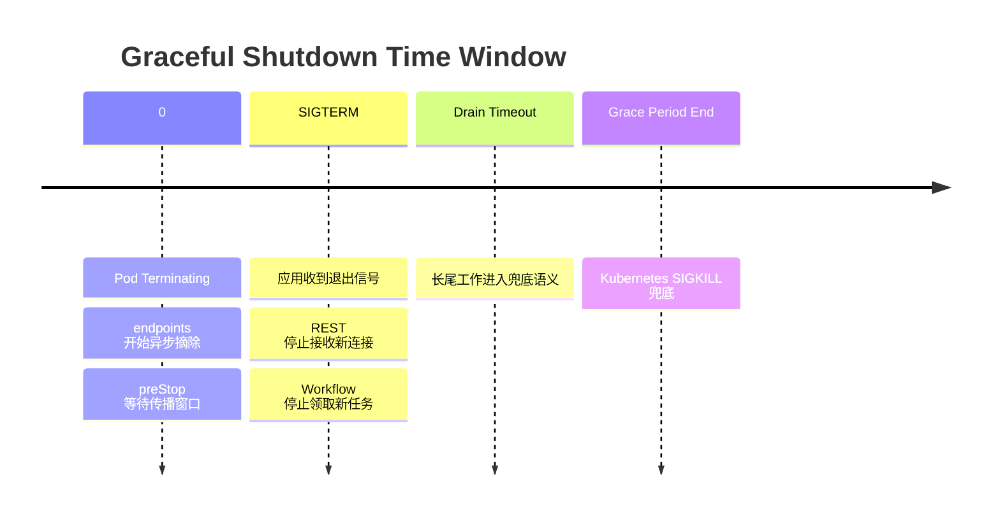
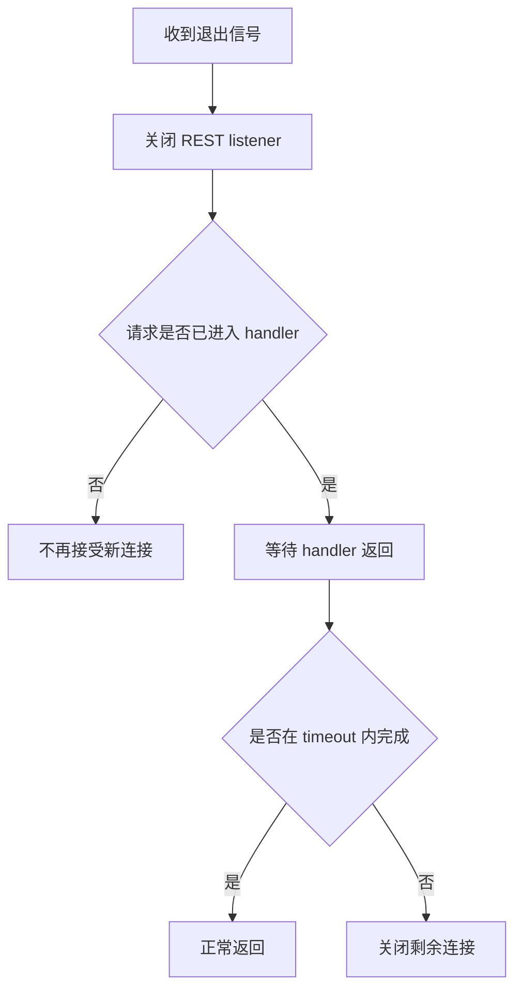
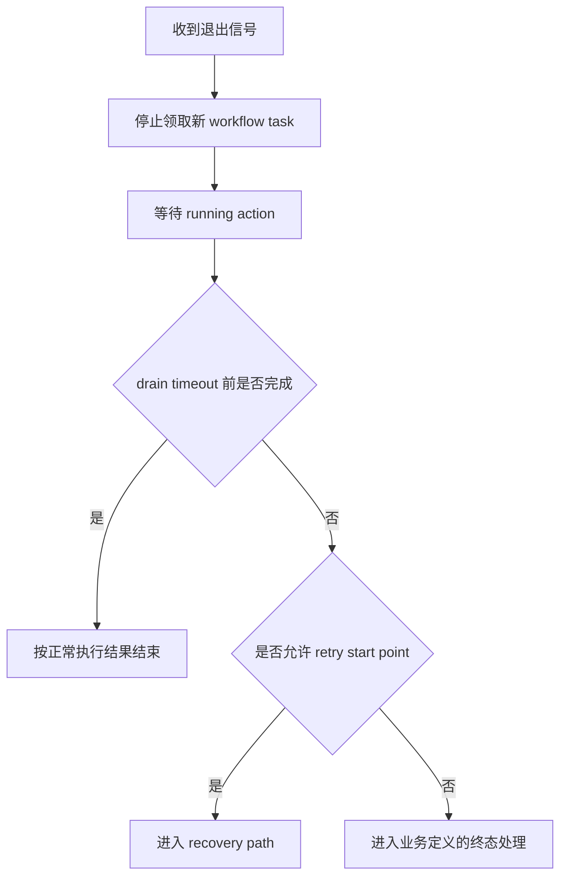

# Server Graceful Shutdown

## 目标

Server graceful shutdown 解决的是 Pod 升级、重启或缩容时的协作式退出问题：尽量停止新流量进入当前
Pod，让已经进入进程的请求和任务在有限时间内完成；超过预算后进入可恢复、可重试或强制退出路径。

## 时间模型

本文以 Pod 进入 `Terminating` 作为时间线 `0` 点。Pod 总退出预算由 `terminationGracePeriodSeconds` 控制，`preStop`、REST
drain、Workflow drain、日志和 tracing flush 都共享这段预算。

默认部署参数：

| 配置                              | 默认值                                 | 语义                         |
|---------------------------------|-------------------------------------|----------------------------|
| `terminationGracePeriodSeconds` | `120s`                              | Pod 总退出预算                  |
| `preStop`                       | `sleep 5`                           | 给 endpoints 摘流传播预留窗口       |
| REST shutdown timeout           | `terminationGracePeriodSeconds / 2` | 等待 in-flight request 的应用预算 |
| Workflow shutdown timeout       | `terminationGracePeriodSeconds / 2` | 等待 running action 的应用预算    |

`preStop` 不是额外时间，会消耗 Pod 总预算。以默认值计算，应用收到 `SIGTERM` 时大约剩余 `115s`，其中 REST 和 Workflow
的默认等待预算为 `60s`。

## 分层语义

Graceful shutdown 分为三层，各层只处理自己拥有的工作：

| 层级         | 负责内容                                    | 不负责内容                           |
|------------|-----------------------------------------|---------------------------------|
| Kubernetes | 摘除 endpoints，发送退出信号，超时后强制结束 Pod         | 判断业务任务是否可重试                     |
| REST       | 停止接收新连接，等待已进入 handler 的请求完成             | handler 派生的后台任务、Workflow action |
| Workflow   | 停止领取新任务，处理 running action 的退出边界，释放可关闭资源 | 继续保证所有长任务在当前 Pod 内完整结束          |

核心原则：

- 摘流依赖 Kubernetes endpoints 异步传播，应用不维护额外摘流状态，也不改变 readiness 结果。
- REST drain 只保护已经进入 HTTP handler 的请求。
- Workflow drain 不承诺长耗时 action 必须在当前 Pod 内跑完，只承诺超时后进入恢复路径或业务定义的终态处理。
- Pod `terminationGracePeriodSeconds` 是最终兜底，应用预算必须小于 Pod 总预算。

## REST 流量

REST graceful shutdown 的语义是：

1. 应用收到退出信号后，REST server 关闭 listener。
2. 已经进入 handler 的 in-flight request 继续执行。
3. request 在 REST shutdown timeout 内返回，则按正常响应结束。
4. timeout 到期后，剩余连接被关闭。

对调用方来说，endpoints 摘流和 `preStop` 降低的是“新请求继续打到正在退出 Pod”的概率；REST graceful shutdown 保障的是已经打到旧 Pod、并进入 handler 的请求尽量完成。它不保证所有长连接、上传下载或慢请求都一定成功完成。长耗时 handler 仍需要在业务层正确处理 context cancellation、超时和重试。

## Workflow 任务

Workflow graceful shutdown 的语义是：

1. Backend 收到退出信号后，不再领取新的 workflow task。
2. 已经开始执行的 action 先获得一段 drain 时间。
3. drain timeout 到期后，running action 被视为长尾工作。
4. 长尾 action 如果允许从 retry start point 重新执行，则进入 recovery path。
5. 不允许从 retry start point 重新执行的 action，进入业务定义的终态处理。

这里的 retry 是 graceful shutdown 触发的恢复语义，用来避免长尾任务无限阻塞 Pod 退出。它不是“当前 Pod 继续把任务跑完”的承诺。是否允许
retry 取决于 action 自身的业务语义；graceful shutdown 只消费这个业务声明，不要求所有 action 都必须可重试。

当前语义下，timeout 到期不会强制中断 action 内部正在执行的阻塞调用；如果 action 没有及时返回，仍依赖业务 timeout、任务
timeout 或 Pod 强制退出兜底。最终业务状态由 action / operation 的业务逻辑决定，`terminated` 只是可能结果之一。