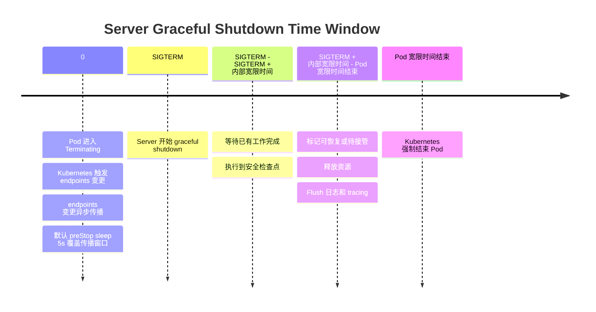
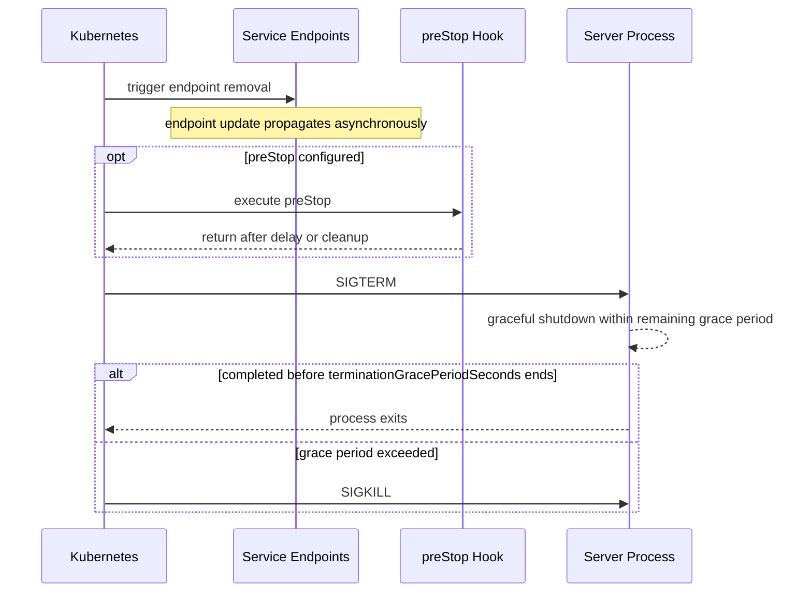
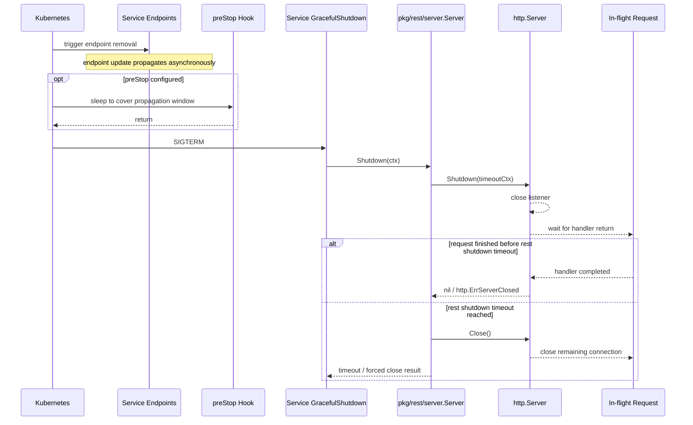

# Server Graceful Shutdown

## 设计范围

本设计先覆盖 `Backend`、`File`、`Application` 三类 Server 进程。

## 退出目标

Server 收到退出信号后，需要在 Kubernetes Pod 宽限时间内完成协作式退出，避免升级或重启过程中出现不必要的请求失败、任务中断或状态不一致。

退出过程有：

- REST 流量

本文以 Pod 进入 `Terminating` 作为退出时间线的 `0` 点。`内部宽限时间` 表示应用收到 `SIGTERM` 后继续等待已有工作的时长，不是从 Pod `0` 点开始计算的绝对时间点。

整体退出过程按三个时间窗口设计：

| 时间窗口                         | 含义                                                  | 目标                                |
|------------------------------|-----------------------------------------------------|-----------------------------------|
| `0` - `SIGTERM`              | Kubernetes 触发 endpoints 变更；kubelet 执行 `preStop` hook     | 让 `preStop` 等待时间覆盖摘流异步传播窗口，降低应用 shutdown 后仍收到新请求的概率 |
| `SIGTERM` - `SIGTERM + 内部宽限时间` | 程序内部控制的正常等待阶段                                       | 尽量让已有工作自然完成，或执行到安全检查点             |
| `SIGTERM + 内部宽限时间` - Pod 宽限时间结束 | Kubernetes `terminationGracePeriodSeconds` 结束前的兜底阶段 | 不再继续推进长耗时工作，完成状态落库、任务恢复、资源释放等兜底逻辑 |

## Kubernetes 终止语义

Server 优雅退出依赖 Kubernetes 的 Pod 终止流程。部署层负责摘流，应用层负责在收到退出信号后处理已经进入进程内的工作。

1. Pod 进入 Terminating 状态。
2. Kubernetes 触发 Service endpoints 变更，流量入口异步感知该变更。
3. kubelet 执行容器 `preStop` hook（如果配置），该过程不依赖 endpoints 变更已经传播完成。
4. kubelet 向容器主进程发送 `SIGTERM`。
5. `preStop` 和应用退出共享 `terminationGracePeriodSeconds` 预算。
6. 超过宽限时间后，Kubernetes 使用 `SIGKILL` 强制结束容器。

需要注意的是，Pod 进入终止流程后，endpoints 变更会异步传播到各流量入口，不存在“endpoints 摘除完成后再执行 `preStop`”的顺序保证。当前 Helm 部署默认配置 `preStop: sleep 5`，是在发送 `SIGTERM` 前预留一段时间覆盖传播窗口，降低应用开始 shutdown 后仍收到新请求的概率。

`preStop` 时间会消耗 Pod 的 `terminationGracePeriodSeconds`，不是额外时间。Helm 默认 `terminationGracePeriodSeconds` 为 `120s`，默认 `preStop` 为 `5s`，因此应用收到 `SIGTERM` 后剩余的退出预算约为 `115s`。用户可以通过各模块的 `lifecycleHooks.preStop` 覆写默认 `preStop`。

应用不维护额外的摘流状态，也不改变 readiness 结果。Helm template 默认按 `terminationGracePeriodSeconds / 2` 渲染应用内部宽限时间；以 `120s` 默认配置为例，内部宽限时间为 `60s`，应用侧兜底阶段约为 `55s`。调整 `preStop` 或 `terminationGracePeriodSeconds` 时，需要保证 `preStop` 时间、REST shutdown 时间、后台任务兜底时间、日志和 tracing flush 时间都包含在 Pod 总宽限时间内。

## REST 流量

REST 层的目标是：停止接收新流量，已经进入 handler 的请求继续处理到完成或超时。

这里的“不接收新流量”主要依赖 Kubernetes 触发 endpoints 变更并由各流量入口异步感知。Pod 进入终止流程后，新的网络流量会随着 endpoints 变更传播逐步停止调度到当前 Pod。

应用侧不维护额外的摘流状态，也不改变 readiness 结果，只负责处理已经进入进程内的请求：

- REST Server 收到退出编排后，关闭 listener，避免继续接受已经到达进程的连接
- 已经进入 handler 的请求继续执行
- 请求处理受 `rest.Server` 自身的 shutdown timeout 和 Pod `terminationGracePeriodSeconds` 约束
- 超过 `rest.Server` 的 shutdown timeout 后，直接关闭剩余连接

这个目标适用于 `Backend`、`File`、`Application`。其中 `File` 可能存在上传、下载等较长请求，需要特别关注已有请求的 drain 行为。

| 时间窗口                         | REST 行为                                            |
|------------------------------|----------------------------------------------------|
| `SIGTERM` - `SIGTERM + 内部宽限时间` | 调用 `http.Server.Shutdown(ctx)`；关闭 listener；已有请求继续处理；等待活跃请求自然结束 |
| `SIGTERM + 内部宽限时间` - Pod 宽限时间结束 | 不再继续等待长尾请求；直接调用 `http.Server.Close()` 关闭剩余连接；记录超时或强制关闭日志 |

### REST Server 职责

REST shutdown 能力放在 `pkg/rest/server.Server` 内部实现，业务服务只负责编排调用。

`rest.Server` 需要提供以下能力：

- 在 `Options` 中提供自身的 shutdown timeout
- 自己创建并持有 `http.Server`
- 使用 Gin engine 作为 `http.Server.Handler`
- 提供 `Shutdown(ctx context.Context) error`
- `Shutdown(ctx)` 内部使用外部 `ctx` 和自身 shutdown timeout 共同约束等待时间
- shutdown timeout 到期后直接调用 `Close()` 关闭剩余连接
- `Shutdown(ctx)` 需要幂等，多次调用不产生重复关闭副作用

`gin.Engine.RunListener(listener)` 不会把 `http.Server` 暴露给 `rest.Server` 管理。`Start()` 需要由 `rest.Server` 自己创建并持有 `http.Server`：

- 非 TLS：`http.Server.Serve(listener)`
- TLS：`http.Server.ServeTLS(listener, "", "")`

`http.ErrServerClosed` 以及 shutdown 过程中由 listener 关闭产生的预期错误，视为正常退出；只有非关闭态下的 serve 错误才作为运行失败返回。

同一个 Service 内可能存在多个 REST Server，例如 `Backend` 的 `info`、`admin`、`basic`、`callback`、`proxy`。这些 REST Server 在退出时应并行 shutdown，不按端口串行等待。

`Shutdown(ctx)` 只负责 HTTP in-flight request，不负责 handler 内额外派生的后台 goroutine、Workflow 或 scheduler。长耗时 handler 应逐步响应 `rCtx.Done()`；REST 机制负责提供 request context 和 shutdown 信号。
