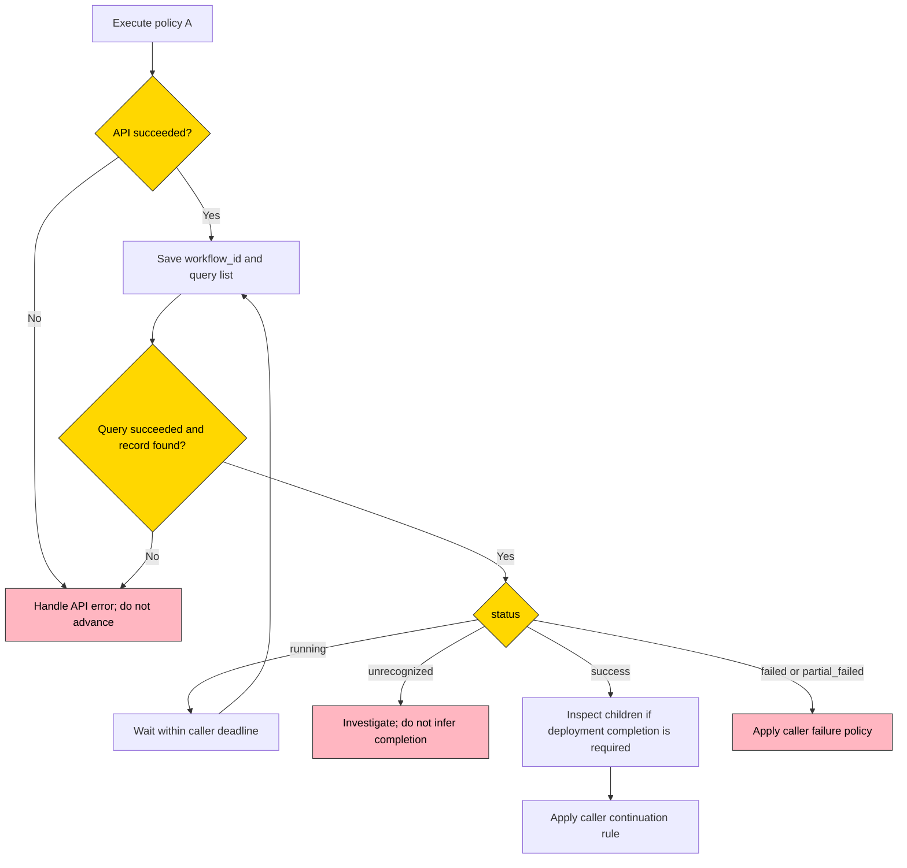

# Deploy policy workflow usage

## Execute, observe dispatch, then inspect children

Use a deploy policy workflow to track **one policy in one execution**, rather than querying all historical workflows associated with a policy ID.

1. Execute policy A and save `data.workflow_id`.
2. Query `POST /api/v3/deploy_policy/workflow/list` with that ID in `exact_include_conditions.workflow_id`.
3. While `status=running`, wait and query again within your own deadline.
4. On `success`, `failed`, or `partial_failed`, the parent dispatch has finished. This says nothing about child completion. Inspect linked children through existing node/plugin APIs if your next step requires deployment completion.
5. On an API error, no matching record, or an unrecognized status, do not infer completion. Investigate or retry the query according to your failure policy.

Node Manager does not wait inside the HTTP request, trigger policy B, or retract subsequent actions already initiated by the caller.



## IDs and execution scope

| ID                              | Meaning                                                                                               |
| ------------------------------- | ----------------------------------------------------------------------------------------------------- |
| `deploy_policy_id`              | The persistent policy definition; reuse it for later executions                                       |
| execute `data.workflow_id`      | This execution of the requested policy; use it to filter the parent list                               |
| list item `trigger_id`          | Trigger association, not an alias for the parent workflow ID                                           |
| list item `children[].workflow_id` | An associated node/plugin business workflow; use the corresponding existing workflow APIs for details |

Each execute call creates a new execution identity, including concurrent calls for the same policy. The dispatch action does not retry automatically. Retrying an uncertain execute request is not an idempotent query and may create another execution.

Discovery still includes related policies. Each participating policy has its own execution record, and records can share children. Execute returns only the requested policy's workflow ID. Use the list API's `deploy_policy_id`, `status`, `operator`, and `operate_time_range` filters to discover history, including scheduled executions.

This is **caller sequencing**, not isolation between related policies. Discovery may execute policy B as part of A's related set before your explicit execute(B). Parent success is not a barrier for child execution; a shared child may contain work for several policies.

## Minimal curl templates

Requirements: `curl`, `jq`, an existing enabled policy, and your deployment's existing API authentication context. No universal gateway URL, auth header, or tenant header is defined here.

Execute once and extract the new workflow ID only after checking the API result:

```bash
set -euo pipefail

BK_NODEMGR_API_BASE="${BK_NODEMGR_API_BASE:?Set the API base URL}"
DEPLOY_POLICY_ID="${DEPLOY_POLICY_ID:?Set an existing enabled policy ID}"

EXECUTE_RESPONSE="$(curl --fail-with-body --silent --show-error \
  -X POST "${BK_NODEMGR_API_BASE}/api/v3/deploy_policy/execute" \
  -H 'Content-Type: application/json' \
  --data "$(jq -n --argjson id "${DEPLOY_POLICY_ID}" '{deploy_policy_id: $id}')")"

WORKFLOW_ID="$(printf '%s' "${EXECUTE_RESPONSE}" | jq -er '
  if .code == 0 then
    .data.workflow_id | select(type == "string" and length > 0)
  else error("execute API failed") end
')"
```

Poll that same parent ID. The interval and limit below are caller-selected examples, not server timing guarantees. An API error, an empty result, or an unrecognized status stops this example; it never advances to another policy automatically.

```bash
set -euo pipefail

BK_NODEMGR_API_BASE="${BK_NODEMGR_API_BASE:?Set the API base URL}"
WORKFLOW_ID="${WORKFLOW_ID:?Use the workflow ID returned by execute}"
POLL_INTERVAL_SECONDS=5
MAX_POLLS=60

for ((attempt = 1; attempt <= MAX_POLLS; attempt++)); do
  RESULT="$(curl --fail-with-body --silent --show-error \
    --connect-timeout 10 --max-time 30 \
    -X POST "${BK_NODEMGR_API_BASE}/api/v3/deploy_policy/workflow/list" \
    -H 'Content-Type: application/json' \
    --data "$(jq -n --arg id "${WORKFLOW_ID}" '{page: {offset: 0, limit: 1}, exact_include_conditions: {workflow_id: [$id]}}')")"

  STATUS="$(printf '%s' "${RESULT}" | jq -er '
    if .code != 0 then error("workflow list API failed")
    elif (.data.items | length) != 1 then error("parent workflow not found")
    else .data.items[0].status | select(type == "string" and length > 0) end
  ')"

  case "${STATUS}" in
    success)
      printf '%s\n' "${RESULT}"
      exit 0  # Dispatch succeeded; inspect children before assuming deployment completion.
      ;;
    failed|partial_failed)
      printf '%s\n' "${RESULT}" >&2
      exit 1
      ;;
    running)
      if ((attempt < MAX_POLLS)); then sleep "${POLL_INTERVAL_SECONDS}"; fi
      ;;
    *)
      printf 'Unexpected status: %s\n' "${STATUS}" >&2
      exit 2
      ;;
  esac
done

printf 'Polling limit reached for workflow %s\n' "${WORKFLOW_ID}" >&2
exit 3  # A caller timeout does not cancel the execution.
```

## Interpret parent status

The response contains `data.total` and `data.items`. Each item contains the parent identity, trigger association, policy ID, operator, operation/finish timestamps, `status`, and child links. Request time ranges use **seconds**; response timestamps use **milliseconds**, with `finish_time=0` while unfinished. Full fields and examples are in the [API reference](../../../apigw/apidocs/en/DeployPolicySvc_WorkflowList.md).

| Parent dispatch operation | status | Caller interpretation |
| --- | --- | --- |
| Unfinished | `running` | Wait within your deadline |
| Successful, including no changes needed | `success` | Dispatch completed; children may still run |
| Failed or timed out | `failed` | Handle dispatch failure; launched children may still run |
| Terminated | `partial_failed` | Handle interrupted dispatch; not a child failure ratio |

The parent tracks one dispatch operation. Its status never aggregates child results and does not wait for children. A child retry does not reopen the parent.

`children` contains only successfully launched workflows whose links were recorded, identified by `(type, workflow_id)`. It has no child status, missing-record flag, or completion count. Missing child records do not alter parent status. A failed dispatch may still have launched children.

Status is synchronized in the background rather than refreshed by each list query. The current monitor refreshes its candidate set every 5 seconds and synchronizes status every 1 second, following the node/plugin monitoring pattern. These intervals are not a completion or visibility SLA. Legacy records without status use the same synchronization; a missing operation keeps an unfinished record running during a one-minute grace period, then marks it failed. Already terminal records preserve their result when the operation is missing.

To require child completion, query each linked workflow through the existing [node](../../../apigw/apidocs/en/NodeWorkflow_NodeWorkflowList.md) or [plugin](../../../apigw/apidocs/en/PluginWorkflow_PluginWorkflowList.md) API and apply your own business rule. Authentication and child IAM checks remain unchanged. Parent visibility does not grant child access; inaccessible or missing children are not evidence of success.

## Errors, retries, and limits

- No matching parent in the current tenant returns an empty list. Invalid requests and data read failures return API errors. Neither outcome proves completion.
- Parent lists retain authentication and tenant isolation without a new IAM action. They do not return a permission-filtered child status summary.
- `only_count=true` returns a parent count and empty `items`; do not use it to poll status.
- There is no automatic dispatch action retry or public deploy-policy workflow retry, terminate, distinct, or statistics API.
- No blocking wait API, automatic sequencing, rollback, or comprehensive duplicate-launch prevention is added.
- Parent success is not child completion or a continuous health guarantee. Retain the machine-side checks described by the chosen spec mode.

## Contract references

- [Integration overview](README.md)
- [Execute API](../../../apigw/apidocs/en/DeployPolicySvc_Execute.md)
- [Workflow list API](../../../apigw/apidocs/en/DeployPolicySvc_WorkflowList.md)
- [Backend proto](../../../proto/backend/api/v3/deploy_policy.proto)
- [Application proto](../../../proto/application/api/v3/deploy_policy.proto)
- [Backend Swagger](../../api/swagger/backend/api/v3/deploy_policy.swagger.json)
