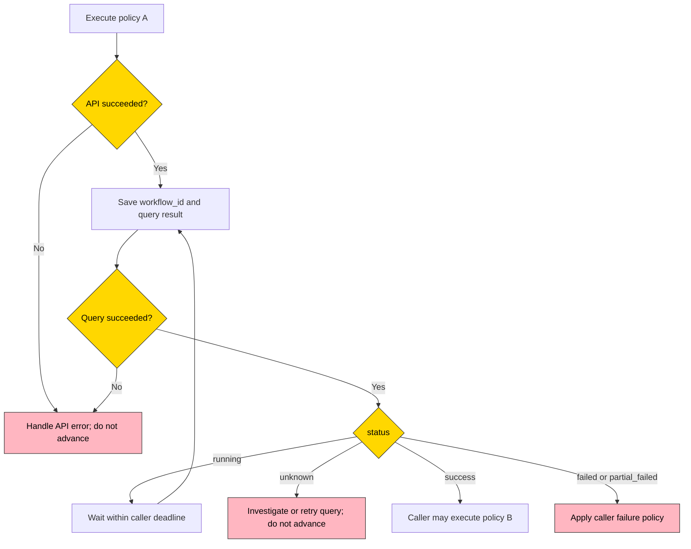

# Deploy policy workflow usage

## Execute, wait, then decide

Use a deploy policy workflow to track **one policy in one execution**, rather than querying all historical workflows associated with a policy ID.

1. Execute policy A and save `data.workflow_id`.
2. Query `POST /api/v3/deploy_policy/workflow/result` with that ID.
3. While `status=running`, wait and query again within your own deadline.
4. On `success`, `failed`, or `partial_failed`, the execution is currently finished. Apply your business rule before executing policy B; finished does not mean successful.
5. On an API error or `unknown`, do not advance based on that response. Investigate or retry the query according to your failure policy.

Node Manager does not wait inside the HTTP request, trigger policy B, or retract subsequent actions already initiated by the caller.



## IDs and execution scope

| ID                              | Meaning                                                                                               |
| ------------------------------- | ----------------------------------------------------------------------------------------------------- |
| `deploy_policy_id`              | The persistent policy definition; reuse it for later executions                                       |
| execute `data.workflow_id`      | This execution of the requested policy; use it for result polling                                     |
| result `children[].workflow_id` | An associated node/plugin business workflow; use the corresponding existing workflow APIs for details |

Each execute call creates a new execution identity, including concurrent calls for the same policy. Automatic retries belong to the same execution and include every newly created child workflow. Retrying an uncertain execute request is not an idempotent query and may create another execution.

Discovery still includes related policies. Each participating policy has its own execution record, and records can share children. Execute returns only the requested policy's workflow ID. The tracking model also covers scheduled executions, but this contract does not add a history/list API to discover their IDs.

This is **caller sequencing**, not isolation between related policies. Discovery may execute policy B as part of A's related set before your explicit execute(B). A shared child may contain work for several policies; waiting for it can wait for their work too.

## Minimal curl templates

Requirements: `curl`, `jq`, an existing enabled policy, and your deployment's existing API authentication context. No universal gateway URL, auth header, or tenant header is defined here.

Execute once and extract the new workflow ID only after checking the API result:

```bash
set -euo pipefail

BK_NODEMGR_API_BASE="${BK_NODEMGR_API_BASE:?Set the API base URL}"
DEPLOY_POLICY_ID="${DEPLOY_POLICY_ID:?Set an existing enabled policy ID}"

EXECUTE_RESPONSE="$(curl --fail-with-body --silent --show-error \
  -X POST "${BK_NODEMGR_API_BASE}/api/v3/deploy_policy/execute" \
  -H 'Content-Type: application/json' \
  --data "$(jq -n --argjson id "${DEPLOY_POLICY_ID}" '{deploy_policy_id: $id}')")"

WORKFLOW_ID="$(printf '%s' "${EXECUTE_RESPONSE}" | jq -er '
  if .code == 0 then
    .data.workflow_id | select(type == "string" and length > 0)
  else error("execute API failed") end
')"
```

Poll that same ID. The interval and limit below are caller-selected examples, not server timing guarantees. An API error, `unknown`, or an unrecognized status stops this example; it never advances to another policy automatically.

```bash
set -euo pipefail

BK_NODEMGR_API_BASE="${BK_NODEMGR_API_BASE:?Set the API base URL}"
WORKFLOW_ID="${WORKFLOW_ID:?Use the workflow ID returned by execute}"
POLL_INTERVAL_SECONDS=5
MAX_POLLS=60

for ((attempt = 1; attempt <= MAX_POLLS; attempt++)); do
  RESULT="$(curl --fail-with-body --silent --show-error \
    --connect-timeout 10 --max-time 30 \
    -X POST "${BK_NODEMGR_API_BASE}/api/v3/deploy_policy/workflow/result" \
    -H 'Content-Type: application/json' \
    --data "$(jq -n --arg id "${WORKFLOW_ID}" '{workflow_id: $id}')")"

  STATUS="$(printf '%s' "${RESULT}" | jq -er '
    if .code == 0 then .data.status | select(type == "string" and length > 0)
    else error("workflow result API failed") end
  ')"

  case "${STATUS}" in
    success)
      printf '%s\n' "${RESULT}"
      exit 0  # The caller may now choose to execute the next policy.
      ;;
    failed|partial_failed)
      printf '%s\n' "${RESULT}" >&2
      exit 1
      ;;
    unknown)
      printf '%s\n' "${RESULT}" >&2
      exit 2  # Investigate unknown_reason; do not advance.
      ;;
    running)
      if ((attempt < MAX_POLLS)); then sleep "${POLL_INTERVAL_SECONDS}"; fi
      ;;
    *)
      printf 'Unexpected status: %s\n' "${STATUS}" >&2
      exit 2
      ;;
  esac
done

printf 'Polling limit reached for workflow %s\n' "${WORKFLOW_ID}" >&2
exit 3  # A caller timeout does not cancel the execution.
```

## Interpret the result

The result contains the policy execution identity, aggregate `status`, `dispatch_status`, `dispatch_error`, `total_count`, `finished_count`, `children`, and `unknown_reason`. Full field definitions and JSON examples belong in the [API reference](../../../apigw/apidocs/en/DeployPolicySvc_WorkflowResult.md).

| Condition, in priority order                                                                  | status           | Caller interpretation                                 |
| --------------------------------------------------------------------------------------------- | ---------------- | ----------------------------------------------------- |
| Missing child, unconfirmed creation, uncertain dispatch closure, or other incomplete evidence | `unknown`        | Cannot determine completion; inspect `unknown_reason` |
| Dispatch/automatic retries are open, or any child is unfinished                               | `running`        | Keep waiting within your deadline                     |
| Normal dispatch closure with no changes needed and no children, or all children successful    | `success`        | Currently finished successfully                       |
| Final dispatch failure after all created children finish, including zero children             | `failed`         | Currently finished with dispatch failure              |
| Normal dispatch closure with every child failed                                               | `failed`         | Currently finished with child failures                |
| Normal dispatch closure with all children finished but mixed results or any partial_failed    | `partial_failed` | Currently finished with partial failure               |

`dispatch_status` describes only the creation phase: `running`, `success`, `failed`, or `unknown`. A final dispatch failure still waits for already created children. During automatic retries, a dispatch error can coexist with `running`.

`total_count` counts known actually created children, not hosts, tasks, or operations. It equals the length of `children`, including previously created children whose records are now missing. Unconfirmed creation intents do not count as actual children and cause `unknown` instead of a false zero-child success.

`finished_count` counts children currently `success`, `failed`, or `partial_failed`. Missing children retain their IDs with `missing=true` and `status=unknown`, and do not count as finished. Counts are per policy execution and deduplicated by `(type, workflow_id)`; shared children can appear in more than one policy's result.

Never infer completion from zero children or `finished_count == total_count`: dispatch may still create more children or evidence may be incomplete.

## Errors, retries, and limits

- A missing parent workflow in the current tenant, an empty workflow ID, or a data read failure is an API error. A missing linked child is a successful query with aggregate `unknown`, not an empty success result.
- `unknown` neither confirms completion nor guarantees work is still running. Timeout or crash alone cannot prove dispatch has stopped. Automatic recovery from every uncertain state is not guaranteed.
- Each query freshly aggregates child business statuses; results are neither a frozen outcome nor a transactional snapshot across children. A retry under the same child ID can make a later result `running` again.
- Authentication and tenant isolation remain. No additional IAM permission is required. Aggregation must not silently use a permission-filtered subset.
- No history list, blocking wait API, automatic sequencing, rollback, or comprehensive duplicate-launch prevention is added.
- Workflow success is not a continuous health guarantee. Retain the machine-side checks described by the chosen spec mode.

## Contract references

- [Integration overview](README.md)
- [Execute API](../../../apigw/apidocs/en/DeployPolicySvc_Execute.md)
- [Workflow result API](../../../apigw/apidocs/en/DeployPolicySvc_WorkflowResult.md)
- [Backend proto](../../../proto/backend/api/v3/deploy_policy.proto)
- [Application proto](../../../proto/application/api/v3/deploy_policy.proto)
- [Backend Swagger](../../api/swagger/backend/api/v3/deploy_policy.swagger.json)
