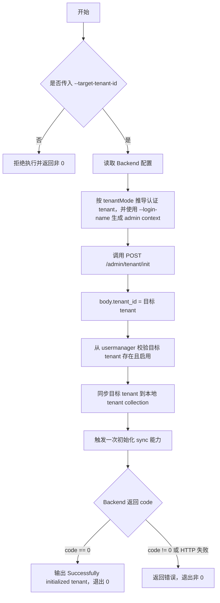

# Backend 管理命令

`bk-nodemgr-adminclient` 是独立的管理 CLI，在镜像中位于 `/bk-nodemgr/bin/bk-nodemgr-adminclient`。本页记录 `backend` 子命令的运维操作。

## 初始化租户

```bash
/bk-nodemgr/bin/bk-nodemgr-adminclient backend tenant init --target-tenant-id example-tenant
```

该命令调用：

```text
bk-nodemgr-adminclient -> backend admin API
```

目标接口：`POST /admin/tenant/init`。

### Tenant 规则

`tenant init` 有两个不同的 tenant 语义：认证 tenant 和目标 tenant。

| 输入                 | 默认值   | 语义                                                               |
| -------------------- | -------- | ------------------------------------------------------------------ |
| Backend `tenantMode` | 配置决定 | 决定认证 tenant：`single` 使用 `default`，`multiple` 使用 `system` |
| `--login-name`       | `admin`  | 认证用户，写入 admin context                                       |
| `--target-tenant-id` | 无，必填 | 目标 tenant，作为接口 body 中的 `tenant_id` 传给 Backend           |

规则：

1. `--target-tenant-id` 必须显式传入；未传时 CLI 在创建 handler 前拒绝执行。
2. 认证 tenant 只能由 Backend 配置的 `tenantMode` 推导；CLI 不提供 `--tenant-id` 参数。
3. `--target-tenant-id` 必须已存在于 usermanager 且处于启用状态；不存在或禁用时拒绝初始化。
4. `system` 是多租户模式保留租户，不走普通租户初始化流程。
5. Backend 会将 usermanager 中的目标租户数据同步到本地 tenant collection，并触发一次该租户的初始化 sync 能力：`sync_biz_and_host`、`sync_networkarea`、`ensure_default_plugin`、`sync_shared_releases`。



### Quick Start

使用默认配置和默认认证用户：

```bash
/bk-nodemgr/bin/bk-nodemgr-adminclient backend tenant init \
  --target-tenant-id example-tenant
```

指定配置文件和认证用户：

```bash
/bk-nodemgr/bin/bk-nodemgr-adminclient backend \
  -f /bk-nodemgr/etc/backend_conf.yaml \
  --login-name admin \
  tenant init \
  --target-tenant-id example-tenant
```

### 配置与连接

`bk-nodemgr-adminclient` 直接读取 Backend 配置。

1. `-f/--file` 默认读取 `/bk-nodemgr/etc/backend_conf.yaml`。
2. CLI 使用 `adminServer.advertiseIPV4` 和 `adminServer.port` 连接 Backend admin server。
3. `tenantMode` 决定认证 tenant：`single` 使用 `default`，`multiple` 使用 `system`。
4. `adminServer.jwtServerConfig.symmetricKey` 用于生成 admin 请求 JWT。

### 输出与退出码

成功时 stdout 输出：

```text
Successfully initialized tenant
Triggered workflows:
- sync_biz_and_host
- sync_networkarea
- ensure_default_plugin
- sync_shared_releases
```

退出码规则：

| 场景                                                                                   | 退出码 |
| -------------------------------------------------------------------------------------- | ------ |
| 缺少 `--target-tenant-id`、配置文件读取失败、配置校验失败                              | 非 0   |
| 目标 tenant 不存在、禁用、为 `system`，或与当前 `tenantMode` 不匹配                    | 非 0   |
| HTTP 调用失败、tenant collection 写入失败、初始化 sync 触发失败、Backend 返回非 0 code | 非 0   |
| Backend 写入目标 tenant 并成功触发初始化 sync                                          | 0      |
