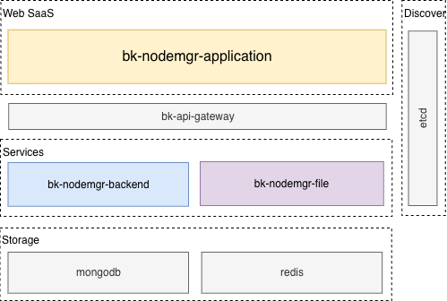
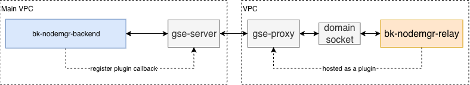
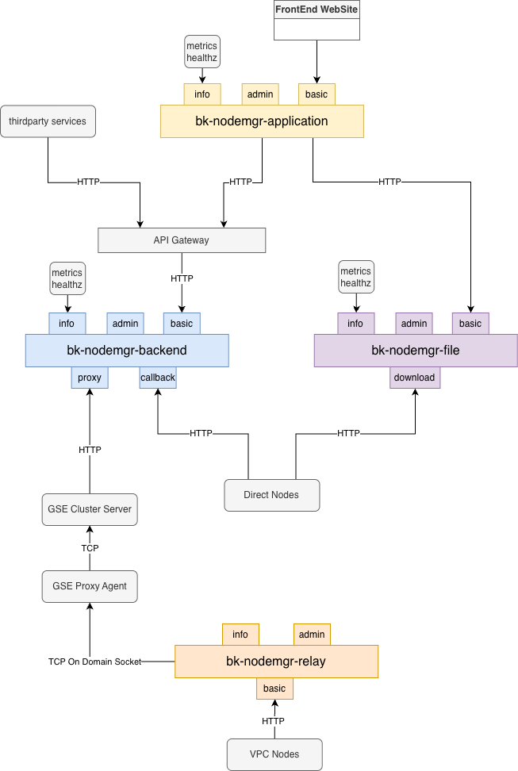

# 节点管理架构

## 基本模块构成

服务层由3个基本模块构成：
- `bk-nodemgr-application`作为SaaS服务，提供基础产品页面、用户登录等功能服务，无状态可以横向扩展。可以部署在蓝鲸PaaS平台上，或是通过helm/docker-compose直接部署。
- `bk-nodemgr-backend`作为后端主服务模块，提供数据管理、流程执行等功能服务，无状态可以横向扩展。
- `bk-nodemgr-file`作为后端文件服务模块，提供上传、下载等文件管理服务，无状态可以横向扩展。

## 跨VPC管理插件

管理VPC的节点时，节点管理会在gse-proxy所在的节点上托管一组插件`bk-nodemgr-relay`，作为一个常驻服务，提供对该proxy区域的节点管理功能。在通信上，relay与proxy节点的agent通过domain socket通信，依赖gse的上下行信令通道实现跨VPC通信。

## 服务

### Application
application的端口服务
- `info`：提供metrics和healthz信息，一般不对外暴露。
- `admin`：提供内部管理功能，一般不对外暴露。
- `basic`：基础前端服务端口，对外暴露。

### Backend
backend的端口服务
- `info`：提供metrics和healthz信息，一般不对外暴露。
- `admin`：提供内部管理功能，一般不对外暴露。
- `basic`：提供基础功能，一般经过APIGW对外暴露。
- `callback`：提供节点回调服务，暴露给直连的节点。
- `proxy`：提供代理服务，暴露给gse-cluster。

### File
file的端口服务
- `info`：提供metrics和healthz信息，一般不对外暴露。
- `admin`：提供内部管理功能，一般不对外暴露。
- `basic`：提供基础功能，对外暴露。
- `download`：提供下载服务，暴露给直连的节点。

### Relay
relay的端口服务
- `info`：提供metrics和healthz信息，一般不对外暴露。
- `admin`：提供内部管理功能，一般不对外暴露。
- `basic`：提供`backend/callback` + `file/download`的组合服务，暴露给当前VPC下的节点。