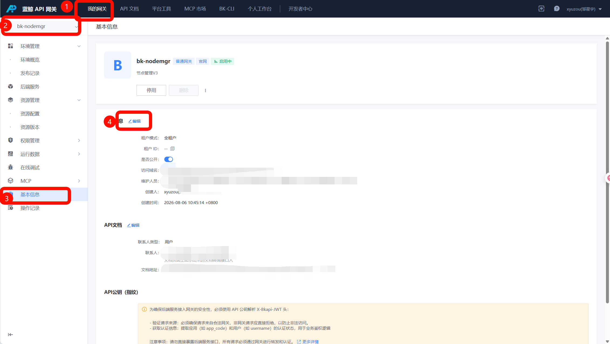
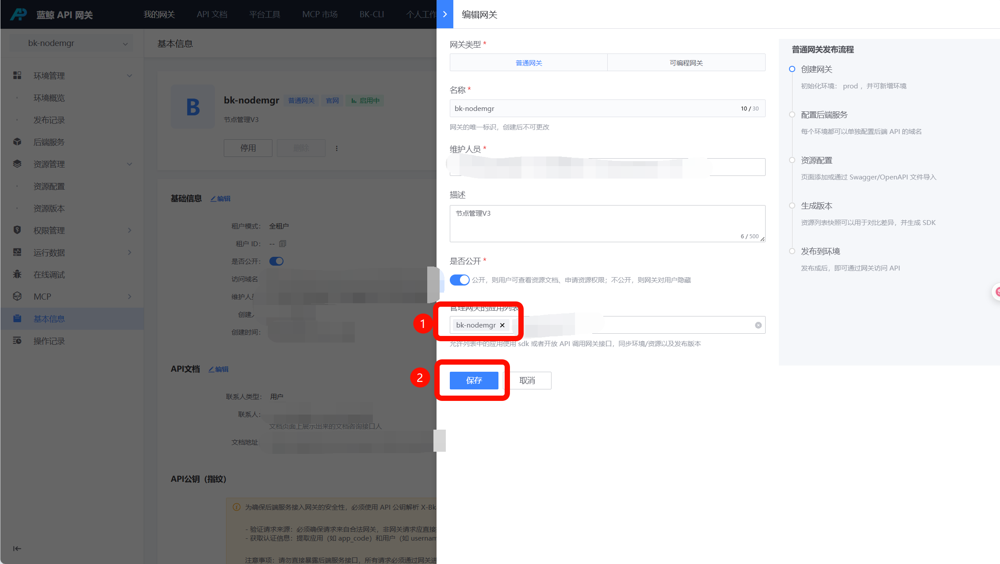

# apigw-sync 前置授权配置

安装前需要将 `bk-nodemgr` 应用加入 `bk-nodemgr` 网关的允许同步应用列表，否则 `apigw-sync` 无法完成网关环境、资源以及版本发布的同步。

## 配置目标

| 配置项             | 配置值       | 说明                                               |
| ------------------ | ------------ | -------------------------------------------------- |
| 网关               | `bk-nodemgr` | 节点管理自身的 API 网关                            |
| 允许同步的应用列表 | `bk-nodemgr` | 允许 `bk-nodemgr` 应用同步该网关的环境、资源和版本 |

## 操作步骤

1. 进入蓝鲸 API 网关，打开“我的网关”。
2. 选择 `bk-nodemgr` 网关，进入“基本信息”页面。

   

3. 在“基础信息”区域点击“编辑”。
4. 在“编辑网关”抽屉中找到“允许同步的应用列表”，加入 `bk-nodemgr`。

   

5. 点击“保存”。

## 确认结果

保存后，“允许同步的应用列表”中应包含 `bk-nodemgr`。后续执行 `apigw-sync` 时，即可同步 `bk-nodemgr` 网关的环境、资源以及版本发布。

更多 `apigw-manager` 使用问题，参考 [bkpaas-python-sdk apigw-manager README](https://github.com/TencentBlueKing/bkpaas-python-sdk/blob/master/sdks/apigw-manager/README.md)。
