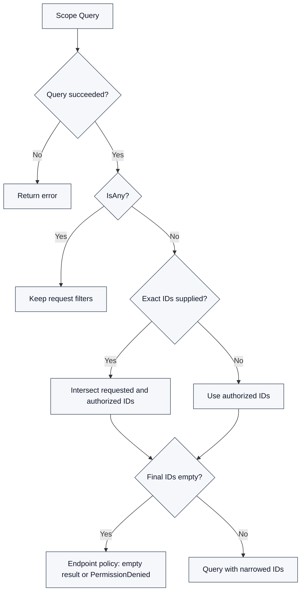

# bk-nodemgr 接入 IAM V4

bk-nodemgr 的 IAM V4 配置、模型对应关系与运行时行为。IAM 接入规则分别见[模型](model.md)、[回调](callback.md)、[鉴权](authorization.md)。

## 接入边界

- IAM 判断用户是否拥有指定 Action/资源权限；Backend 负责确定请求需要的 Action 和资源，并在需要时收敛数据查询范围。
- IAM 通过 callback 读取项目资源实例；注册模型与运行时鉴权是两条独立路径。

## 配置与路由

| 项目              | 当前实现                                                                                                        | 依据                                                                                                                                 |
| ----------------- | --------------------------------------------------------------------------------------------------------------- | ------------------------------------------------------------------------------------------------------------------------------------ |
| 版本选择          | `iamV3.enable` 与 `iamV4.enable` 不允许同时开启；均关闭时使用 NoOp authorizer，不代表通过了 IAM 鉴权            | [配置](../../../../pkg/config/backend.go)、[装配](../../../../internal/backend/service/service.go)                                   |
| V4 身份与地址     | `iamV4.systemID`、`endpoints`、APIGateway 应用身份配置；启用时要求 `callbackPath` 非空                          | [Backend 配置](../../../../pkg/config/backend.go)、[客户端配置](../../../../pkg/thirdparty/iamv4/types.go)                           |
| API 前缀          | client 以 `/api` 为 base URL，子路径从 `/v1/...` 开始；endpoint 不应再重复附带该 `/api` 层                      | [client](../../../../pkg/thirdparty/iamv4/iamv4.go)                                                                                  |
| callback 路由     | `POST /api/v3/iam/v4/resource`，由 Basic API 路由入口加载，校验 `bk_iam` 与系统 token                           | [API 入口](../../../../internal/backend/router/api-v3/api-v3.go)、[V4 路由](../../../../internal/backend/router/api-v3/iam/v4/v4.go) |
| callback 注册地址 | System 的 `callback_url` 必须能从 IAM 到达该路由；`callbackPath` 当前不驱动路由注册，不能只改配置就假定路由变化 | [路由](../../../../internal/backend/router/api-v3/iam/v4/v4.go)、[配置传递](../../../../internal/backend/service/service.go)         |

项目不在此固定某个内网环境地址。联调前分别验证 API endpoint 与 callback 的反向可达性，不能用单向 API 调用成功代替 callback 验证。

## 模型映射

| 对象                         | 当前项目依据                                                                                     | 接入时不能作出的推断                                          |
| ---------------------------- | ------------------------------------------------------------------------------------------------ | ------------------------------------------------------------- |
| `networkarea -> networkunit` | 两类 Provider 与父子授权范围展开已存在                                                           | 不代表对应 V4 ResourceType、Action、Role 已注册               |
| `package_type -> package`    | 两类 Provider 与父子授权范围展开已存在                                                           | 不代表包类型分组自动生成了角色                                |
| `biz`                        | 业务权限调用仍通过 `BuildBizResources` 构造 CMDB 业务资源；V4 callback 未注册本地 `biz` Provider | 不能把 v3 跨系统资源引用直接视为 v4 已支持的模型              |
| Action                       | 运行时使用 `biz_access`、Agent/Proxy/Plugin、策略、网络、资源包等操作常量                        | 有常量不代表目标 IAM 已有相同 Action                          |
| Role                         | 需明确角色包含的 Action 与允许授权的资源层级                                                     | 不能用 v3 `action_groups`、`common_actions` 替代 V4 Role 设计 |

依据：[Provider 注册](../../../../internal/backend/service/service.go)、[Provider 实现](../../../../internal/backend/auth/provider/)、[Action 常量](../../../../internal/backend/auth/action.go)、[业务资源构造](../../../../internal/backend/router/api-v3/auth/auth.go)。

[资源类型应按所需权限粒度选择](model.md#按权限粒度选择资源)，不能因项目有主机、脚本等数据就自动注册对应资源类型。业务维度鉴权与具体实例鉴权应分别确定；[创建类操作](model.md#创建类操作)也应明确是否绑定父资源。现有 `biz_access` 等 Action ID 需与已注册模型保持一致。

模型工具与运行时分开维护：

- [V3 模板说明](../../../../support-files/bkiamv3/templates/README.md)维护 v3 operation 与模型规则，不是 v4 兼容性声明。
- [V4 System 模板](../../../../support-files/bkiamv4/templates/0001_bk_nodemgr_system.json.tpl)采用 `callback_url`、数组 `clients`；渲染与注册工具的使用方式见 [V4 工具目录](../../../../support-files/bkiamv4/)。

## 运行时映射

以下接口对应项目 [client](../../../../pkg/thirdparty/iamv4/iamv4.go) 与 [wire 类型](../../../../pkg/thirdparty/iamv4/types.go)。表中路径相对于 `/api/v1/open/rbac/authorization/systems/{system_id}`。

| 能力           | 项目接口形状                                                  | 当前处理                                               |
| -------------- | ------------------------------------------------------------- | ------------------------------------------------------ |
| 单次鉴权       | `/auth/`；`subject`、`action_id`、可选 `resource`             | 读取 `allowed`                                         |
| 单操作、多资源 | `/auth-by-resources/`；`subject`、`action_id`、`resources`    | 逐项读取 `resource_id`、`allowed`                      |
| 多操作、单资源 | `/auth-by-actions/`；`subject`、`action_ids`、可选 `resource` | 逐项读取 `action_id`、`allowed`                        |
| 授权范围       | `/relation/authorized-resources/`；`subject`、`action_id`     | 响应项为 `type`、`ids`，由 authorizer 解释为项目 Scope |

[V4 authorizer](../../../../internal/backend/auth/auth_iamv4.go)按 20 分批；这是项目分批值，IAM API 的批量上限需另行确认。批量鉴权结果缺项时不会按允许处理。

权限拒绝时，authorizer 通过 [Handler.GetApplyURL](../../../../pkg/thirdparty/iamv4/handler.go)提交缺失 Action 与资源拓扑。获取 URL 失败仍返回权限拒绝，只是 `ApplyURL` 为空。申请 URL 的生成不证明授权成功。

## 授权范围

项目 `AuthorizedScope` 表达给定 Action 和资源类型允许访问的实例范围，完整通用规则见 [Backend Auth](../../../../internal/backend/auth/README.md)。V4 适配当前区分：

- 目标资源类型的 `ids` 含 `"*"`：返回 `IsAny=true`。
- 明确的目标实例 ID：去重后作为授权集合。
- 父级授权：仅展开 `networkarea -> networkunit`、`package_type -> package` 两条已有关系。
- 父类型的 `"*"`：枚举当前目标实例，而不是直接把目标范围标为 `IsAny=true`。

Scope Query 不替代调用方要求的 Permission Check；两者是否同时需要由 endpoint 决定。以下只展示查询范围的收敛过程：

请求范围只能被授权范围收窄，不能被扩大。无授权实例或交集为空时，由 endpoint 选择空结果或 `PermissionDenied`；调用错误不能伪装成空授权集合。

## 待核实项

| 项目              | 已知证据或差异                                                                                                     | 核实方式                                                                  |
| ----------------- | ------------------------------------------------------------------------------------------------------------------ | ------------------------------------------------------------------------- |
| Role 注册字段     | 原文 `action_ids` 与 `actions` 示例冲突，资源层级配置字段缺失                                                      | 获取目标环境 Role 注册/更新 Schema；确认后再定义项目角色模板              |
| callback 分页     | 摘录使用 `page/page_size`；V4 路由复用的 [转换器](../../../../pkg/proto/backend/api/v3/iam.go)读取 `offset/limit`  | 用目标 IAM 的真实 callback 请求核对分页、总数及翻页结果；不能只验证第一页 |
| callback 属性选择 | [请求表与参考实现](callback.md#fetch_instance_info)均使用顶层 `requires`；当前路由只向 Dispatcher 传递 filter/page | 核对属性选择的传递，验证 `display_name`、拓扑按需查询与默认属性查询       |
| callback 响应     | 摘录要求 `data` / `error` 与 `X-Request-Id`；当前路由使用项目 REST 包装，Basic Auth 失败使用 `code/message`        | 对照真实 HTTP 状态、封装与 Request ID；路由存在不等于协议兼容             |
| 鉴权拓扑          | 摘录要求拓扑授权携带 `resource.attributes._bk_iam_path_`；当前 V4 wire `Resource` 仅包含 `id`                      | 确认目标 IAM 是否仍要求属性，以及父级授权对子资源鉴权的结果               |
| 批量与关系查询    | 摘录无完整 Schema，`relations/*` 与当前 `relation/authorized-resources/` 不同                                      | 核实具体路径、批量限制、逐项结果、`"*"` 和父级返回语义                    |
| 业务资源模型      | 运行时存在 CMDB `biz` 资源，但本地 V4 Provider 只有四类资源                                                        | 确认 V4 中业务资源归属、跨系统引用和对应 Action/Role 注册方式             |
| 实例审批人        | 按资源负责人审批需要 `_bk_iam_approvers_` 属性和角色关联的实例审批流                                               | 采用前确定负责人来源，同时配置回调属性与角色审批流                        |

## 接入验证清单

- [ ] 对目标环境核实 System/ResourceType/Action/Role Schema，确认注册 ID 与运行时 ID 一致。
- [ ] 核实 API endpoint 前缀、应用身份、System ID，以及 IAM 到 callback 的反向访问。
- [ ] 验证 callback 认证失败、分页、父级过滤、关键字搜索、实例详情与响应封装。
- [ ] 验证父资源与关键字取交集、`count` 为过滤后的总数，以及 `requires` 的按需属性查询。
- [ ] 验证空 ID 列表不会触发全量查询，缺失或空 token 不会通过认证；成功和失败响应均回传 `X-Request-Id`。
- [ ] 验证直接鉴权的允许、拒绝、调用失败，以及父级授权对子实例的判断。
- [ ] 验证批量结果、授权范围全量标记、父级展开和请求范围交集。
- [ ] 验证权限拒绝中的申请 URL；URL 获取失败不能放行请求。

Provider 开发可参考[已有指南](../../../developer/iam_provider_guide.md)；该指南使用 v3 路径，V4 协议以[资源回调](callback.md)为准。
