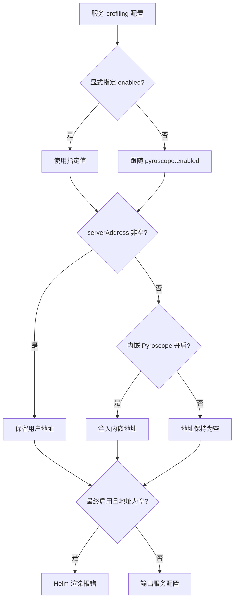

## Blueking NodeMgr

此Chart用于在Kubernetes集群中通过helm部署蓝鲸智云节点管理服务(bk-nodemgr)

### K8S集群准备

开始部署前，请准备好一套Kubernetes集群（版本1.12或更高），并安装Helm命令行工具（3.0或更高版本）

### 安装Chart

安装bk-nodemgr，你必须先添加一个有效的Helm repo仓库

```shell
## 请将 `<HELM_REPO_URL>` 替换为本 Chart 所在的 Helm 仓库地址
$ helm repo add bk <HELM_REPO_URL>
```

添加仓库成功后，执行以下命令，在集群内安装名为`bk-nodemgr`的Helm release（使用默认项目配置）：

```shell
$ helm install bk-nodemgr bk/bk-nodemgr
```

> 注: ChartName为bk-nodemgr，基于模板设计规则，请保证部署的ReleaseName中包含ChartName

上述命令将使用默认配置在Kubernetes集群中部署bk-nodemgr, 并输出相关运行信息。

### 配置说明

下面展示了可配置的参数列表以及默认值

#### 全局公共配置

**Chart全局配置**

| 参数             | 类型   | 默认值                     | 描述         |
| ---------------- | ------ | -------------------------- | ------------ |
| image.registry   | string | hub.bktencent.com          | 镜像源地址   |
| image.repository | string | blueking/bk-nodemgr-server | 服务镜像     |
| image.tag        | string | Chart对应的既定版本号      | 服务镜像标签 |
| image.pullPolicy | string | IfNotPresent               | 镜像拉取策略 |

#### 公共组件配置

**外置Etcd配置**

| 参数                   | 类型   | 默认值 | 描述                                         |
| ---------------------- | ------ | ------ | -------------------------------------------- |
| externalEtcd.endpoints | list   | 空     | 外置etcd服务endpoint地址, 多个以列表形式声明 |
| externalEtcd.username  | string | 空     | 外置etcd服务username                         |
| externalEtcd.password  | string | 空     | 外置etcd服务password                         |
| externalEtcd.tls.ca    | string | 空     | 外置etcd服务的客户端证书CA内容(base64编码)   |
| externalEtcd.tls.cert  | string | 空     | 外置etcd服务的客户端证书Cert内容(base64编码) |
| externalEtcd.tls.key   | string | 空     | 外置etcd服务的客户端证书Key内容(base64编码)  |

**外置Redis配置**

| 参数                   | 类型   | 默认值  | 描述                                          |
| ---------------------- | ------ | ------- | --------------------------------------------- |
| externalRedis.type     | string | cluster | 外置redis部署类型                             |
| externalRedis.host     | string | 空      | 外置redis服务地址                             |
| externalRedis.port     | int    | 6379    | 外置redis服务端口                             |
| externalRedis.username | string | default | 外置redis服务用户名                           |
| externalRedis.password | string | 空      | 外置redis服务密码                             |
| externalRedis.tls.ca   | string | 空      | 外置redis服务的客户端证书CA内容(base64编码)   |
| externalRedis.tls.cert | string | 空      | 外置redis服务的客户端证书Cert内容(base64编码) |
| externalRedis.tls.key  | string | 空      | 外置redis服务的客户端证书Key内容(base64编码)  |

**外置MongoDB配置**

| 参数                           | 类型   | 默认值          | 描述                                                     |
| ------------------------------ | ------ | --------------- | -------------------------------------------------------- |
| externalMongodb.replicaSetName | string | rs0             | 外置mongodb服务replica set名称                           |
| externalMongodb.hosts          | array  | 空              | 外置mongodb服务地址列表；mongodb.enabled=false时必须配置 |
| externalMongodb.username       | string | nodemgr         | 外置mongodb服务用户名                                    |
| externalMongodb.password       | string | defaultpassword | 外置mongodb服务密码                                      |
| externalMongodb.database       | string | nodemgr         | 外置mongodb服务DB名称                                    |
| externalMongodb.authSource     | string | admin           | 外置mongodb服务认证数据库                                |
| externalMongodb.authMechanism  | string | SCRAM-SHA-256   | 外置mongodb服务认证机制                                  |
| externalMongodb.tls.ca         | string | 空              | 外置mongodb服务的客户端证书CA内容(base64编码)            |
| externalMongodb.tls.cert       | string | 空              | 外置mongodb服务的客户端证书Cert内容(base64编码)          |
| externalMongodb.tls.key        | string | 空              | 外置mongodb服务的客户端证书Key内容(base64编码)           |

#### 自监控配置

自监控组件默认关闭，按需启用。Grafana 只负责展示，需要同时启用至少一个内嵌数据源：`tempo.enabled=true`、`prometheus.enabled=true`、`loki.enabled=true` 或 `pyroscope.enabled=true`。采集服务 trace 时，推荐启用 `opentelemetryGateway.enabled=true` 作为统一 OTLP Gateway，再由 Gateway 转发到 Tempo。

| 参数                         | 类型   | 默认值 | 描述                                                                  |
| ---------------------------- | ------ | ------ | --------------------------------------------------------------------- |
| tempo.enabled                | bool   | false  | 启用内嵌 Tempo，用于存储和查询链路追踪数据                            |
| pyroscope.enabled            | bool   | false  | 启用内嵌 Pyroscope，未显式配置 profiling.enabled 的服务自动开始采集 |
| opentelemetryGateway.enabled | bool   | false  | 启用 OpenTelemetry Collector Gateway，作为服务 trace 的推荐入口        |
| prometheus.enabled           | bool   | false  | 启用内嵌 Prometheus，用于采集 bk-nodemgr 服务指标                     |
| loki.enabled                 | bool   | false  | 启用内嵌 Loki，用于存储并查询 Alloy 采集的 Kubernetes Pod 日志        |
| alloy.enabled                | bool   | false  | 启用内嵌 Alloy，以 DaemonSet 采集 Kubernetes Pod 日志并写入内嵌 Loki  |
| grafana.enabled              | bool   | false  | 启用内嵌 Grafana，用于查看 Tempo、Prometheus、Loki 和 Pyroscope 数据源           |
| grafana.rootURL              | string | 空     | Grafana 访问地址，启用 Grafana 时必填，需包含结尾 `/`                 |
| grafana.adminUser            | string | admin  | Grafana 管理员用户名                                                  |

Profiling 最小启用示例：

```yaml
pyroscope:
  enabled: true
grafana:
  enabled: true
  rootURL: https://nodemgr.example.com/grafana/
```

`application.config.profiling`、`backend.config.profiling`、`file.config.profiling` 分别控制服务采集。启用状态和上报地址独立解析，用户显式配置优先：

| 配置 | 解析规则 |
| --- | --- |
| `enabled` 显式为 `true` 或 `false` | 严格使用指定值 |
| 未指定 `enabled` | 跟随 `pyroscope.enabled`；仅填写地址不会启用采集 |
| `serverAddress` 非空 | 保留用户地址 |
| `serverAddress` 为空且内嵌 Pyroscope 开启 | 注入内嵌 Service 的 HTTP 地址 |
| 最终启用但没有可用地址 | Helm 渲染报错 |



例如，`backend.config.profiling.enabled: false` 可在开启内嵌 Pyroscope 时关闭 backend 采集。连接外部 Pyroscope 且内嵌组件关闭时，必须同时配置 `enabled: true` 和 `serverAddress: https://profiles.example.com`。`applicationName`、`basicAuthUser`、`basicAuthPassword`、`tenantID`、`headers`、`tags` 和 `profileTypes` 按原有服务配置传递；`profileTypes` 留空使用 CPU 和内存采集默认值。

Profiles 通过现有 SDK 直接上报，不经过 OpenTelemetry Gateway 或日志 Alloy。Grafana 的内嵌 Pyroscope 数据源始终查询内嵌后端；给服务填写外部地址不会改写该数据源。服务最终 profiling 配置变化会触发 Pod 更新；修改内嵌数据源地址或端口后，按现有方式重启 Grafana 以加载 provisioning 配置。

内嵌 Pyroscope 默认以单副本运行，使用 filesystem 存储；默认未启用持久化，Pod 替换后数据丢失。需要保留数据时，参考 `values-example.yaml` 设置 `pyroscope.pyroscope.persistence`。本地存储配置不适用于跨 Pod 扩容。

Trace 和指标最小启用示例：

```yaml
tempo:
  enabled: true
opentelemetryGateway:
  enabled: true
prometheus:
  enabled: true
grafana:
  enabled: true
  rootURL: https://nodemgr.example.com/grafana/
```

日志采集最小启用示例：

```yaml
loki:
  enabled: true
  singleBinary:
    persistence:
      enabled: true
      storageClass: ""
      size: 8Gi
alloy:
  enabled: true
grafana:
  enabled: true
  rootURL: https://nodemgr.example.com/grafana/
```

> 注: `tempo.enabled=true` 的默认 local 存储仅适合开发或验证环境；生产环境建议参考 `values-example.yaml` 配置对象存储。`loki.enabled=true` 默认使用 single-binary filesystem 存储，`loki.singleBinary.persistence.enabled=false` 仅适合开发或验证环境；生产环境建议参考 `values-example.yaml` 开启 PVC。`grafana.rootURL` 需要和实际 Ingress、网关或端口转发访问路径保持一致。

> 注: `alloy.enabled=true` 依赖 `loki.enabled=true`。Alloy 会以 DaemonSet 在每个节点运行，通过 `/var/log/pods` 和 `/var/lib/docker/containers` 采集集群内 Kubernetes Pod 日志，采集范围不是仅限 bk-nodemgr。启用前请确认日志隐私、存储容量和节点资源开销符合预期。

启用 Grafana 后，登录用户默认为 `admin`。管理员密码由 Grafana Chart 在 Secret 中生成并在升级时复用。若 ReleaseName 为 `bk-nodemgr`，默认 Secret 名称为 `bk-nodemgr-grafana`，可通过以下命令获取：

```shell
$ kubectl get secret -n <namespace> bk-nodemgr-grafana -o jsonpath='{.data.admin-password}' | base64 -d; echo
```

如果使用了其它 ReleaseName，请将 Secret 名称中的 `bk-nodemgr` 替换为实际 ReleaseName，例如 `<release-name>-grafana`。如果配置了 `grafana.fullnameOverride` 或 `grafana.nameOverride`，请以实际生成的 Secret 名称为准。

自监控开启后，`application.config.tracing`、`backend.config.tracing`、`file.config.tracing` 控制三个服务的 trace exporter。推荐路径是服务先发往内嵌 OpenTelemetry Collector Gateway，再由 Gateway 转发到 Tempo。若 `opentelemetryGateway.enabled=true` 且对应服务未显式配置 `otlpEndpoint`，Chart 会自动将 trace 发往 Gateway；只有在未启用 Gateway、但启用了 `tempo.enabled=true` 时，才会回退为服务直连内嵌 Tempo。自动接线会写入 `exporterType: "otlp"`、`otlpProtocol: "grpc"`、`otlpInsecure: true`。

| 参数                                        | 类型   | 默认值 | 描述                                                                 |
| ------------------------------------------- | ------ | ------ | -------------------------------------------------------------------- |
| `<service>.config.tracing.exporterType`     | string | stdout | trace exporter 类型；可设为 `otlp` 发往 OTLP backend                  |
| `<service>.config.tracing.otlpEndpoint`     | string | 空     | OTLP endpoint；为空时可由内嵌自监控组件自动接线                      |
| `<service>.config.tracing.otlpProtocol`     | string | grpc   | OTLP 协议；合法值为 `grpc` 或 `http`，非法非空值会导致服务启动失败   |
| `<service>.config.tracing.otlpInsecure`     | bool   | false  | 是否关闭 OTLP TLS 校验；内嵌自监控自动接线时为 `true`                |
| `<service>.config.tracing.otlpHeaders`      | object | {}     | 发送 OTLP 请求时附加的 HTTP/gRPC metadata，例如鉴权 header           |

`<service>` 可替换为 `application`、`backend` 或 `file`。`otlpProtocol` 配置错误时，服务启动校验会返回 `otlp protocol is invalid`。启用自监控时，优先保持服务 trace 自动接线到 Gateway；需要转发到外部 OTLP HTTP backend 时，应配置 `opentelemetryGateway.alternateConfig`，由 Gateway 负责外发。`alternateConfig` 会完整替换 Collector 配置，因此需要同时声明 receiver、processor、exporter 和 pipeline。

通过 Gateway 转发到外部 OTLP HTTP backend 示例：

```yaml
opentelemetryGateway:
  enabled: true
  alternateConfig:
    receivers:
      otlp:
        protocols:
          grpc:
            endpoint: 0.0.0.0:4317
          http:
            endpoint: 0.0.0.0:4318
    processors:
      memory_limiter:
        limit_mib: 512
        spike_limit_mib: 128
        check_interval: 5s
      batch: {}
    exporters:
      otlphttp/external:
        endpoint: https://otel-collector.example.com:4318
        headers:
          Authorization: Bearer <token>
    extensions:
      health_check:
        endpoint: 0.0.0.0:13133
    service:
      extensions:
        - health_check
      pipelines:
        traces:
          receivers:
            - otlp
          processors:
            - memory_limiter
            - batch
          exporters:
            - otlphttp/external
```

仅在不启用 Gateway、且确实需要服务直连外部 OTLP backend 时，才直接配置 `<service>.config.tracing.otlpEndpoint` 和 `otlpProtocol`。服务进程的 OTLP HTTP endpoint 使用 `host:port`，trace 默认路径为 `/v1/traces`。

#### Ingress 访问配置

Ingress 默认关闭。按访问对象区分为三类：`application.ingress` 用于节点管理 Web/API 服务入口，`backend.ingress` 用于 backend TCP 服务入口，`grafana.ingress` 用于自监控 Grafana 入口。

**Application Ingress**

`application.ingress` 支持两种模式：`className` 为空时使用 BCS Network Extension Ingress；`className` 非空时使用标准 Kubernetes Ingress。

| 参数                                | 类型   | 默认值              | 描述                                            |
| ----------------------------------- | ------ | ------------------- | ----------------------------------------------- |
| application.ingress.enabled         | bool   | false               | 是否创建 application Ingress                    |
| application.ingress.lbid            | string | 空                  | BCS Network Extension 负载均衡实例 ID           |
| application.ingress.lbPolicy        | string | WRR                 | BCS 负载均衡策略，可选 `WRR`、`LEAST_CONN`      |
| application.ingress.isDirectConnect | bool   | true                | BCS Network Extension 是否使用直连模式          |
| application.ingress.certID          | string | 空                  | BCS HTTPS 证书 ID，配置后使用 HTTPS 监听        |
| application.ingress.domain          | string | nodemgr.example.com | 访问域名                                        |
| application.ingress.path            | string | /                   | 访问路径                                        |
| application.ingress.className       | string | 空                  | 标准 Kubernetes IngressClass 名称，例如 `nginx` |
| application.ingress.tlsSecretName   | string | 空                  | 标准 Kubernetes Ingress TLS Secret 名称         |

标准 Kubernetes Ingress 示例：

```yaml
application:
  ingress:
    enabled: true
    className: nginx
    domain: nodemgr.example.com
    path: /
    tlsSecretName: nodemgr-tls
```

BCS Network Extension Ingress 示例：

```yaml
application:
  ingress:
    enabled: true
    lbid: <bcs-lb-id>
    lbPolicy: WRR
    isDirectConnect: true
    certID: <bcs-cert-id>
    domain: nodemgr.example.com
    path: /
```

**Backend Ingress**

`backend.ingress` 创建的是 BCS Network Extension TCP Ingress，会暴露 `backend.config.basicServer.port` 和 `backend.config.proxyServer.port`。

| 参数                            | 类型   | 默认值 | 描述                                       |
| ------------------------------- | ------ | ------ | ------------------------------------------ |
| backend.ingress.enabled         | bool   | false  | 是否创建 backend TCP Ingress               |
| backend.ingress.lbid            | string | 空     | BCS Network Extension 负载均衡实例 ID      |
| backend.ingress.lbPolicy        | string | WRR    | BCS 负载均衡策略，可选 `WRR`、`LEAST_CONN` |
| backend.ingress.isDirectConnect | bool   | true   | 是否使用直连模式                           |

```yaml
backend:
  ingress:
    enabled: true
    lbid: <bcs-lb-id>
    lbPolicy: WRR
    isDirectConnect: true
```

**Grafana Ingress**

`grafana.enabled=true` 只会创建 Grafana 服务，默认不会创建外部访问入口。需要通过 Ingress 访问 Grafana 时，请同时启用 `grafana.ingress.enabled=true`，并确保 `grafana.rootURL` 与 Ingress 的域名和路径一致。

| 参数                             | 类型   | 默认值              | 描述                            |
| -------------------------------- | ------ | ------------------- | ------------------------------- |
| grafana.ingress.enabled          | bool   | false               | 是否创建 Grafana Ingress        |
| grafana.ingress.ingressClassName | string | 空                  | IngressClass 名称，例如 `nginx` |
| grafana.ingress.hosts            | list   | chart-example.local | Grafana 访问域名                |
| grafana.ingress.path             | string | /                   | Grafana 访问路径                |
| grafana.ingress.pathType         | string | Prefix              | Ingress 路径匹配类型            |
| grafana.ingress.tls              | list   | []                  | HTTPS 证书配置                  |

```yaml
grafana:
  enabled: true
  rootURL: https://nodemgr.example.com/grafana/
  ingress:
    enabled: true
    ingressClassName: nginx
    hosts:
      - nodemgr.example.com
    path: /grafana
    pathType: Prefix
    tls:
      - secretName: nodemgr-grafana-tls
        hosts:
          - nodemgr.example.com
```

> 注: 使用子路径访问 Grafana 时，`grafana.rootURL` 必须包含相同子路径并以 `/` 结尾，例如 `https://nodemgr.example.com/grafana/`。如果只使用根路径访问，可将 `grafana.ingress.path` 设置为 `/`，并将 `grafana.rootURL` 设置为对应域名根路径。

### 滚动升级

通过以下命令滚动升级`bk-nodemgr`:

```shell
$ helm upgrade --install bk-nodemgr bk/bk-nodemgr
```

### 卸载Chart

通过以下命令卸载`bk-nodemgr`:

```bash
helm uninstall bk-nodemgr
```

上述命令将移除所有和蓝鲸智云节点管理相关的Kubernetes组件，并删除release。
