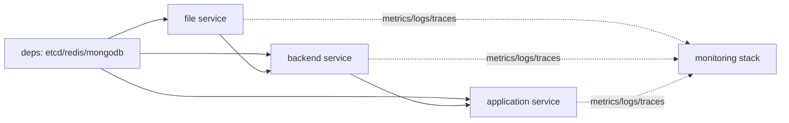

# bk-nodemgr Helmfile

本目录提供 bk-nodemgr 的 Helmfile 部署入口，目标是用一份 `example` environment 在 Kubernetes/minikube 中部署一套多租户示例环境。

## 部署模型

`example` environment 拆成 5 个 release。每个 release 使用同一个 `bk-nodemgr` chart，通过不同 values template 控制启用的模块。

| 顺序 | module        | namespace                      | 职责                                |
| ---- | ------------- | ------------------------------ | ----------------------------------- |
| 1    | `deps`        | `bk-nodemgr-deps`              | 部署内置 `etcd`、`redis`、`mongodb` |
| 2    | `file`        | `blueking-nodemgr-file`        | 部署 File 服务                      |
| 3    | `backend`     | `blueking-nodemgr-backend`     | 部署 Backend 服务                   |
| 4    | `application` | `blueking-nodemgr-application` | 部署 Application 服务               |
| 5    | `monitoring`  | `bk-nodemgr-monitoring`        | 部署自监控组件                      |

`diff`、`apply`、`sync` 按上表顺序执行；`destroy` 反向执行。



## 配置入口

主配置文件是 `environments/example/env.yaml`。

该文件只放 environment 差异和必须显式填写的业务字段，不重复 `install/helm/bk-nodemgr/values.yaml` 已有默认值。

核心分区：

- `releaseName`：Helm release name。
- `chart`：chart 来源；本地 example 默认指向 `../../helm/bk-nodemgr`。
- `namespaces`：5 个 release 的 namespace。
- `global`：多租户、BlueKing app、统一 JWT 和访问用户配置。
- `global.ingress`：统一入口域名、path、ingress class 和 TLS secret；Grafana 默认使用这里的 `grafanaPath`。
- `global.bkApiUrlTmpl`：BlueKing API Gateway endpoint 模板。
- `backend.config`：Backend 需要用户显式确认的业务字段。
- `application.config`：Application 需要用户显式确认的业务字段。
- `file.config`：File 需要用户显式确认的业务字段。

## 用户必须确认的字段

`example` 保留空值或示例值，用于提示用户部署前必须按目标环境调整。

### global

- `global.appSecret`：真实 BlueKing app secret。
- `global.user`：调用 BlueKing API 的用户名。
- `global.access.virtualUser`：Backend/Application 使用的虚拟用户。
- `global.serviceJwt.symmetricKey`：File、Backend、Application 之间共享的 JWT symmetric key。
- `global.bkApiUrlTmpl`：BlueKing API Gateway endpoint 模板，默认 `https://example.com/api/{gateway_name}/prod`。
- `global.ingress`：Application 和 Grafana 共用的入口配置；`path` 用于 Application，`grafanaPath` 用于 Grafana。

### API Gateway

默认只配置 `global.bkApiUrlTmpl`，模板里的 `{gateway_name}` 会按下面的映射生成各服务使用的 endpoint。

如果某个 gateway 需要特殊地址，不要修改模板逻辑；在对应 release 的 `overrides/*.yaml` 中覆盖 chart 原生 values。

当前映射：

- `nodemgr` -> `bk-nodemgr`
- `cmdb` -> `bk-cmdb`
- `gse` -> `bk-gse`
- `userManager` -> `bk-user`
- `bkUserWebURL` -> `bk-user-web`
- `bkLogin` -> `bk-login`
- `iamV3` -> `bk-iam`
- `iamV4` -> `bkiam`
- `notice` -> `bk-notice`
- `monitor` -> `bk-monitor`

### backend

- `backend.config.basicServer.jwtServerConfig.publicKeyPem`：API Gateway 调用 Backend 时使用的 JWT public key。`cryptoType: asymmetric` 是 chart 固定语义，不在 `env.yaml` 中重复配置。
- `backend.config.cmdb.supplierAccount`：CMDB supplier account。
- `backend.config.networkUnit.defaultDirectUnit`：默认直连 network unit。
- `backend.config.gse.pluginSlotID`、`backend.config.gse.pluginSlotToken`：GSE plugin slot 信息。
- `backend.config.gseDeployConfs`：Linux/Windows 部署路径和脚本配置。
- `backend.config.iamV3`、`backend.config.iamV4`：IAM 是否启用、system ID 和 callback path。

### application

- `application.config.front.*`：前端页面使用的 BlueKing URL。
- `application.config.bkSaaS.bkLogin.loginURL`、`authType`：登录配置。
- `application.config.bkPaaS.analysisScript`：PaaS analysis script。
- `application.config.notice.enabled`：通知能力是否启用。
- `application.config.iamV3`：IAM V3 是否启用、system ID 和 callback path。

### file

- `file.config.repo.endpoint`、`projectID`、`repoName`、`accessKey`、`secretKey`：BKRepo 直连配置。该配置不走 API Gateway，必须显式填写。
- `file.config.gse.pluginSlotID`、`file.config.gse.pluginSlotToken`：GSE plugin slot 信息。

## 内置依赖与 external 覆盖

`example` 默认部署 `deps` release，并在 `file`、`backend`、`application` template 中自动生成内部依赖地址：

- `externalEtcd` 指向 `bk-nodemgr-etcd-headless.<deps namespace>.svc.cluster.local:2379`
- `externalRedis` 指向 `bk-nodemgr-redis-headless.<deps namespace>.svc.cluster.local:6379`
- `externalMongodb` 指向 `bk-nodemgr-mongodb-headless.<deps namespace>.svc.cluster.local:27017`

不要把这些内部地址写进 `env.yaml`。它们是 Helmfile topology 推导值。

如果目标环境已有外部 Etcd/Redis/MongoDB，在对应 `overrides/*.yaml` 覆盖 `externalEtcd`、`externalRedis`、`externalMongodb`。

## overrides 边界

`environments/example/overrides/*.yaml` 是 Helm 原生兜底覆盖入口，不是常规环境配置入口。

规则：

- 常规 environment 配置写入 `env.yaml`。
- 已识别的用户必填字段按 `backend`、`application`、`file` 分组写入 `env.yaml`。
- 只有 shared template 没覆盖到、或需要临时覆盖 chart 原生 values 时，才写 `overrides/*.yaml`。
- 外部依赖替换也通过 `overrides/*.yaml` 完成。

## 自监控 release

`monitoring` release 参考 `install/helm/bk-nodemgr/values-example.yaml`，默认启用：

- `tempo`
- `opentelemetryGateway`
- `prometheus`
- `grafana`
- `loki`
- `alloy`
- `pyroscope`

默认保留本地持久化配置：

- Prometheus：`8Gi`
- Loki：`8Gi`
- Grafana：`1Gi`
- Pyroscope：`10Gi`

Grafana 默认配置：

- `rootURL` 根据 `global.ingress.domain` 和 `global.ingress.grafanaPath` 生成。
- `ingress.enabled` 使用 `global.ingress.enabled`。
- `ingressClassName` 使用 `global.ingress.className`。
- `hosts` 使用 `global.ingress.domain`。
- `path` 使用 `global.ingress.grafanaPath`。
- TLS secret 使用 `global.ingress.tlsSecretName`；为空时不渲染 TLS。

`file`、`backend`、`application` 的 tracing 会自动指向 monitoring release 中的 `opentelemetryGateway`，Gateway 再导出到内置 Tempo。该联动只设置 OTLP exporter、endpoint、protocol 和 insecure 模式，不修改各服务的 `traceSampleRate`。

`tempo` 没有复制 `values-example.yaml` 中的 S3 示例；S3 是生产外部对象存储示例，不适合作为本地 minikube 默认值。

## 部署命令

本目录优先使用 `bin/` 下的本地工具，但二进制不提交到仓库。首次使用前先下载：

```bash
./bin/install-tools.sh
```

脚本会下载 Linux amd64 版本：

- `bin/helm`
- `bin/helmfile`
- `bin/helm-plugins/diff`

`deploy.sh` 会优先使用 `bin/helmfile` 和 `bin/helm`。如果 `bin/helm-plugins` 存在，脚本会通过 `HELM_PLUGINS` 使用本地 `helm diff` plugin；否则回退到用户环境中的 Helm plugin 配置。

进入目录：

```bash
cd install/helmfile/bk-nodemgr
```

渲染差异：

```bash
./deploy.sh diff example
```

部署：

```bash
./deploy.sh apply example
```

同步：

```bash
./deploy.sh sync example
```

只渲染最终 Helm values，不部署：

```bash
./deploy.sh render-values example
```

`render-values` 底层使用 Helmfile `write-values`，默认追加 `--skip-deps`，输出到：

```text
rendered-values/<environment>/values/<namespace>.yaml
```

例如：

```text
rendered-values/example/values/bk-nodemgr-deps.yaml
rendered-values/example/values/blueking-nodemgr-backend.yaml
rendered-values/example/values/blueking-nodemgr-application.yaml
```

`rendered-values/<environment>/values/` 默认被 `.gitignore` 忽略，只作为本地检查和排查使用，不提交到仓库。

`render-values` 要求选中的 release name 全部相同，文件名按 namespace 区分。当前 Helmfile 拓扑中各 module 的 release name 均为 `bk-nodemgr`，namespace 可不同。

销毁：

```bash
./deploy.sh destroy example
```

也可以直接按 module 渲染单个 release：

```bash
helmfile -f helmfile.yaml.gotmpl -e example -l module=backend template --skip-deps
```

可用 module：`deps`、`file`、`backend`、`application`、`monitoring`。

`deploy.sh` 会把 action 和 environment 之后的参数透传给 Helmfile。调试 dependency 或 diff 时可使用：

```bash
./deploy.sh diff example --skip-deps --debug
```

省略 environment 时默认使用 `example`：

```bash
./deploy.sh diff --skip-deps --debug
```

只运行指定 module：

```bash
./deploy.sh diff example --modules file,backend --skip-deps
./deploy.sh render-values example --modules file,backend
```

跳过指定 module：

```bash
./deploy.sh diff example --skip-module monitoring --skip-deps
./deploy.sh render-values example --skip-module monitoring
```

`--modules` 和 `--skip-module` 可以组合使用，最终执行顺序仍由脚本内置依赖顺序决定。`destroy` 始终使用反向顺序。非法 module 会直接报错并打印合法列表。

## 修改规则

新增或调整配置时按这个顺序判断：

1. 如果是 chart 已有默认值，不要复制到 `env.yaml`。
2. 如果是 environment 必填业务差异，放到 `env.yaml` 的对应服务分组。
3. 如果是 Helmfile topology 推导值，放到对应 `templates/*.yaml.gotmpl`。
4. 如果是临时覆盖 chart 原生 values，放到 `overrides/*.yaml`。
5. 如果会改变服务启动配置契约，同步检查 `install/helm/bk-nodemgr/values.yaml` 和相关 chart template。
