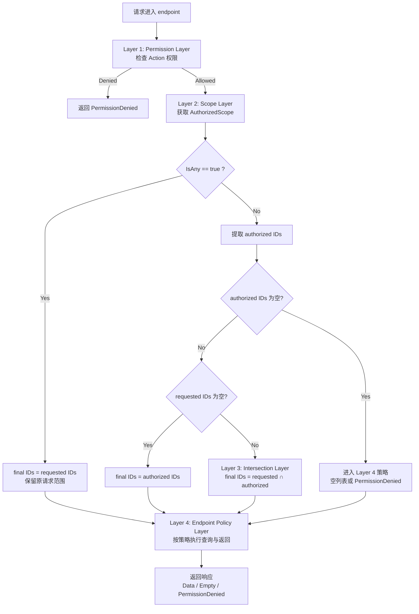

# Backend Auth 逻辑说明

## 1. Auth 解决什么问题

Backend 在处理请求时，会面对两个独立的鉴权问题（按接口类型决定是否都需要）：

1) **Permission 层（必选）**：这个用户能不能做这个动作（`Action`）？
2) **Scope 层（按需）**：当接口需要实例级控制（尤其是 list/query）时，在给定 `Action + ResourceType` 的前提下，确定“该 action 可执行的实例集合”。

对应地，Auth 提供两类能力：

- **Permission Check**：回答“能不能做”
- **Scope Query**：回答“给定 action 时，可在哪些实例上执行”

## 2. Scope 的核心语义（`AuthorizedScope`）

`AuthorizedScope` 可以理解为“在给定 `Action + ResourceType` 条件下，可执行实例集合的范围表达”。

它只有两个关键状态：

- `IsAny = true`：全量范围（full access）
- `IsAny = false`：非全量，需要看授权实例列表（authorized instances）

## 3. Scope 收敛（narrowing）逻辑

目标：把“用户请求范围（requested IDs）”和“授权允许的实例集合（authorized IDs）”合并成最终允许执行的实例集合。

规则如下：

1) `IsAny = true`
- 直接保留用户请求范围
- 等价于：不额外收窄

2) `IsAny = false` 且授权实例为空
- 视为当前资源类型上没有可用授权实例
- 后续由调用方根据 endpoint 语义决定返回策略（例如 `PermissionDenied` 或空结果）

3) `IsAny = false` 且授权实例非空
- 若用户没传 exact IDs：最终范围 = 全部授权实例
- 若用户传了 exact IDs：最终范围 = 请求范围 ∩ 授权范围

一句话：**用户请求不会被放大，只会被授权范围收窄。**

## 4. List 类接口的决策模型

对 list endpoint，建议先做 scope 收敛，再进入查询。

推荐决策顺序：

1) 读取用户请求的 exact IDs（若有）
2) 获取 `AuthorizedScope`
3) 计算 `final IDs`（按第 3 节规则）
4) 再决定返回策略：
   - 全量访问：保留原条件
   - 部分访问：使用收窄后的 `final IDs`
   - 无授权实例：按产品策略统一处理（返回 denied 或空结果）

## 4.1 Scope 收缩四层模型

可以把 scope narrowing 固定理解成四层：

1) **Layer 1 - Permission Layer（动作层）**
   - 先判断用户是否具备 `Action` 执行资格（能不能看/改/删）。
   - 这是入口层，回答的是 “Can or Cannot”。

2) **Layer 2 - Scope Layer（范围层）**
   - 查询 `AuthorizedScope`：是 `IsAny=true` 还是实例级授权。
   - 这是范围定义层，回答的是 “Any or Restricted”。

3) **Layer 3 - Intersection Layer（交集层）**
   - 将用户请求范围（requested IDs）与授权范围（authorized IDs）做合并：
     - 未传请求 IDs：使用授权范围
     - 已传请求 IDs：使用交集 `requested ∩ authorized`
   - 这是核心收缩层，回答的是 “Final IDs”。

4) **Layer 4 - Endpoint Policy Layer（返回策略层）**
   - 将收缩结果映射为接口行为：
     - 继续查询并返回结果
     - 返回空列表
     - 返回 `PermissionDenied`
   - 这是业务语义层，回答的是 “How to Respond”。

一句话：前 3 层决定“能看哪些”，第 4 层决定“怎么返回”。

## 4.2 Scope 收缩流程图

简化口径：

- 先过动作权限（Permission）
- 再确定授权范围（Scope）
- 再做交集收缩（Intersection）
- 最后按接口策略返回（Policy）

## 5. 为什么要区分 Permission 和 Scope

因为“能做动作”与“可见实例范围”不是一回事：

- Permission 解决的是 **Yes/No**
- Scope 解决的是 **How Much**

这层区分能避免两类常见问题：

1) 只做 Permission，不做 Scope，导致 list 越权返回
2) 把 Scope 空集误当作系统错误，导致行为不一致

## 6. No-op 模式的逻辑语义

在 no-op authorizer 下，逻辑等价于：

- Permission Check 总是通过
- Scope 总是 full access（`IsAny=true`）

也就是：不做实际鉴权收窄，仅保留请求本身的过滤条件。
