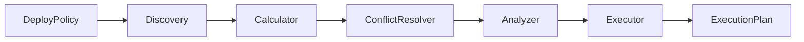

# Deploy Policy

## 概述

部署策略模块（deploy-policy）负责处理多策略部署时的关联策略发现、目标计算、冲突解决、状态分析和执行编排。

## 架构设计

### 核心组件

```
Handler (主处理器)
├── Discovery (关联策略发现器) - IPolicyDiscovery
├── Calculator (范围计算器) - IScopeCalculator
├── ConflictResolver (冲突解决器) - IConflictResolver
├── Analyzer (状态分析器) - IAnalyzer
└── Executor (执行编排器) - IExecutor
```

### 处理流程



## 五阶段处理模式

### 1. Discover - 关联策略发现
- **组件**: `IPolicyDiscovery`
- **职责**: 查找本次需要执行的 deploy policy 的关联策略
- **输入**: 初始部署策略列表
- **输出**: 完整的部署策略列表（包含关联策略）

### 2. Convert - 范围转换
- **组件**: `IScopeCalculator`
- **方法**: `Calculate(nCtx, scopes...)`
- **职责**: 将部署策略的范围（Scope）转换为目标节点（Targets）
- **支持范围类型**: Topo、ServiceTemplate、Instance、SetTemplate、DynamicGroup
- **并发处理**: 支持并发计算，默认并发数 10

### 3. Resolve - 冲突解决
- **组件**: `IConflictResolver`
- **方法**: `ResolveConflict(originalUnits)`
- **职责**: 检测并解决多策略间的目标冲突
- **策略**: 先到先得（按创建时间排序）
- **粒度**: 按 `DeploySpec` 的 `UniqueID()` 进行分组冲突检测

### 4. Analyze - 状态分析
- **组件**: `IAnalyzer`
- **职责**: 检查各个 `target` 是否符合 `spec`，分析需要的变更动作

### 5. Execute - 执行编排
- **组件**: `IExecutor`
- **职责**: 根据 `ChangeAction` 分组，并执行变更
