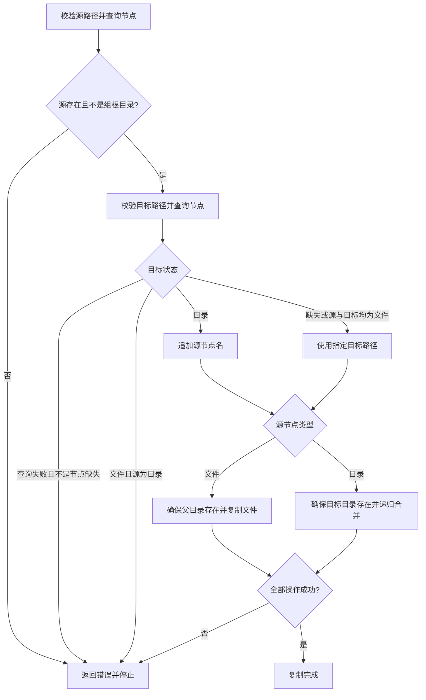

# transfer

## 设计意图

通过 `CopyStream` 为实现 `FileGroup` 接口的实例提供文件和目录的流式复制能力。通过接口完成目录查询与遍历、源文件读取和目标写入。

## 功能边界

- 负责文件组实例之间复制的目标定位、递归遍历、空目录创建和文件流传输。
- 各后端的 `FileGroup.Copy` 负责选择原生复制或本包的流式复制；同后端组合先执行各自的原生复制规则。
- 路径合法性由后端目录方法校验，租户复制策略由服务层包装组处理。

## 核心流程

调用方通过后端的 `FileGroup.Copy` 发起复制。进入流式复制后，按以下规则处理：

## 路径与复制规则

1. 路径相对于各自文件组，使用 `/` 分隔。后端先校验原始输入，拒绝空路径、绝对路径、反斜杠、NUL 和越出组根目录的路径，再进行路径规范化。
2. 源路径必须指向组内节点；`.` 只允许表示目标组根目录。
3. 目标已是目录时，在其下使用源节点名；目标缺失时，使用指定路径并创建所需父目录。
4. 目录复制递归合并，保留空目录和目标中的无关条目；目标为文件时，目录复制失败。
5. `overwrite` 控制每个目标文件是否允许覆盖，由目标 `Store` 执行；文件与目录冲突会返回错误。

## 文件流与错误语义

- 每个源文件通过 `Content` 获取流，复制流程负责关闭；目标 `Store` 仅借用流。
- 写入失败或调用发生 panic 时仍会关闭已获取的流；写入与关闭同时失败时保留两个错误。
- 遇到第一个错误即停止，已经写入的文件或创建的目录不会回滚。

## 使用限制

1. `CopyStream` 是底层流式复制工具，不执行原生复制分派、源与目标身份或目录重叠检查、租户复制策略。业务调用应使用 `FileGroup.Copy`；直接使用 `CopyStream` 的调用方须先完成这些检查和策略处理。
2. 原生复制保留各后端原有的路径语法，跨后端路径规则不替代原生规则。
3. 流式复制只传递目标 `Store` 接受的文件信息，不保证保留本地权限、时间戳或仓库专有元数据。
