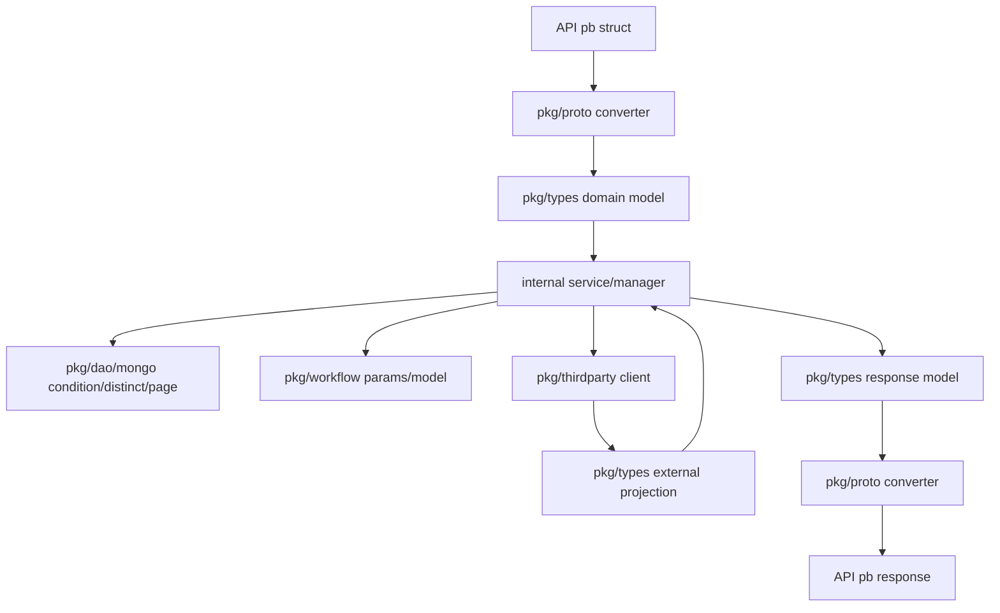

# types

## 模块目标

`pkg/types` 是 bk-nodemgr 的 shared domain contract。它把 handler、service/manager、storage、workflow、proto converter 之间需要共享的业务对象固定下来，避免各层直接传递 `pb` struct、Mongo schema 或第三方 SDK shape。

核心规则：业务层只依赖 `pkg/types` 表达的 domain model；transport、storage、third-party 形态必须在各自边界完成转换。

## 核心语义对象

| 语义对象               | 文件                                                              | 负责什么                                                   |
| ---------------------- | ----------------------------------------------------------------- | ---------------------------------------------------------- |
| Inventory model        | `host.go`, `topo.go`, `scope.go`, `tenant.go`                     | 主机、拓扑、scope、tenant 等基础业务对象                   |
| Package / plugin model | `release.go`, `plugin.go`, `upload.go`                            | 安装包、插件、上传来源和版本元数据                         |
| Deployment model       | `deploy_policy.go`, `node_deployment.go`, `plugin_deployment.go`  | 部署策略、目标 spec、节点/插件部署状态                     |
| Workflow model         | `node_workflow.go`, `plugin_workflow.go`, `scheduled_workflow.go` | 节点/插件操作工作流和调度工作流                            |
| Query contract         | `condition.go`, `distinct.go`, `page.go`                          | DAO filter、distinct aggregation、pagination/sort          |
| Operation params       | `node_agent.go`, `node_proxy.go`, `manager.go`                    | install/upgrade/restart/reconfig/uninstall 等 manager 入参 |
| External projection    | `gse.go`, `cmdb.go`, `iam.go`, `notice.go`, `relay.go`            | 第三方概念在系统内部使用的投影类型                         |

## 使用决策规则

### 1. 什么时候应该新增或修改 `pkg/types`

只有当一个概念需要跨层或跨服务稳定传递时，才放入 `pkg/types`：

1. API request/response 需要进入业务层：先在 `pkg/proto/*` 转成 `pkg/types`。
2. DAO 查询或聚合需要被 service 复用：扩展 `condition.go`、`distinct.go` 或 `page.go`。
3. manager/workflow 需要稳定入参：扩展 `manager.go`、`node_agent.go`、`node_proxy.go` 或 workflow model。
4. 第三方返回结构需要进入内部逻辑：先定义 internal projection，不能直接泄漏 raw SDK/API shape。

不要因为单个 handler 临时需要字段就提前抽到 `pkg/types`。如果语义只属于一个 endpoint 或一个 service policy，先留在 `internal/<service>` 对应层。

### 2. 什么时候不应该改 `pkg/types`

以下内容不属于 `pkg/types`：

- `pb` lifecycle：放在 `pkg/proto/*`，业务层使用前必须转换。
- Mongo collection schema 或查询实现：放在 `pkg/dao/mongo/**`。
- service-specific policy：放在 `internal/<service>`。
- 第三方 raw request/response：放在 `pkg/thirdparty/**`。
- 只有 UI 展示需要、后端语义未确定的字段：先不要新增共享 model。

## 数据流规则

这条链路的重点不是函数调用顺序，而是类型边界：

- `pb struct` 只在 transport boundary 内生存。
- `pkg/types` 是业务层可共享的语义对象。
- DAO、workflow、third-party client 可以消费或返回 `pkg/types`，但不能把自己的内部 shape 反向扩散到业务层。

## 关键模式

### Enum pattern

可被外部输入或跨层传递的枚举，应使用 named type + `const` 表达，并在需要时提供：

- `Validate()`：只校验取值是否合法，不写业务策略。
- `*ListToStringList` / `StringListTo*List`：用于 API serialization 或 query 参数转换。

### Union type pattern

`Scope` 和 `DeploySpec` 都是 union type：同一时间只能有一个 branch 生效。

使用规则：

1. 通过 `NewScopeWith*` 或 `NewDeploySpecWith*` 创建。
2. 通过 `Type()` 判断 branch。
3. 通过 `Get*` accessor 读取 branch payload。
4. 不直接设置内部字段，否则会破坏“单一 branch” invariant。

### Query contract pattern

`condition.go` 用三段式表达查询：

1. `*ExactFields`：精确匹配字段。
2. `*FuzzyFields`：模糊匹配字段。
3. `*Condition`：组合 exact、fuzzy、`TimeRange`、`Page`。

`distinct.go` 用 selector/result 表达聚合：

1. `*DistinctRequest` 或 `*DistinctSelector`：bool 字段表示要聚合哪些列。
2. `*DistinctResult`：slice 字段承载聚合结果。
3. `New*AllSet()`：表示全字段聚合，避免调用方手写一组 `true`。

## 边界与返回策略

| 场景                 | 正确做法                                              | 不要这样做                                       |
| -------------------- | ----------------------------------------------------- | ------------------------------------------------ |
| API 新字段进入业务层 | 在 `pkg/proto/*` converter 中转换为 `pkg/types`       | handler 直接把 `pb` struct 传给 manager/storage  |
| 新增查询条件         | 扩展对应 `*Condition` 并让 DAO 显式消费               | 在 service 中拼 Mongo filter 或复制 OptFn helper |
| 新增枚举值           | 更新 named type const、`Validate()` 和必要转换 helper | 使用裸 string 并在多处散落判断                   |
| 新增 scope/spec 分支 | 增加 constructor、`Type()`、accessor、converter       | 直接暴露多个可同时设置的字段                     |
| 接入第三方结构       | 定义内部 projection，只保留系统需要的字段             | 把第三方 SDK response 作为业务 contract          |

## 维护检查清单

- [ ] 新类型是否真的是跨层或跨服务 contract？
- [ ] 名称是否与 proto、DAO、front、docs 中同一概念保持一致？
- [ ] 是否先搜索了同类 model、enum、condition、distinct、union type 的现有写法？
- [ ] 是否把 business policy 留在 `internal/<service>`，只在这里保留结构和值域 contract？
- [ ] 如果 transport 可见，是否同步更新 `pkg/proto/*` converter？
- [ ] 如果查询可见，是否同步更新 `pkg/dao/mongo/**` 的 filter/aggregation 使用点？
