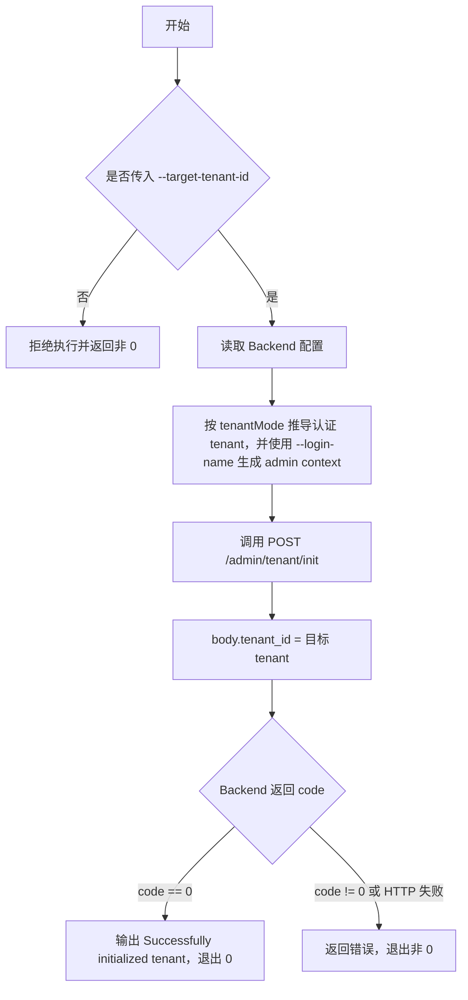
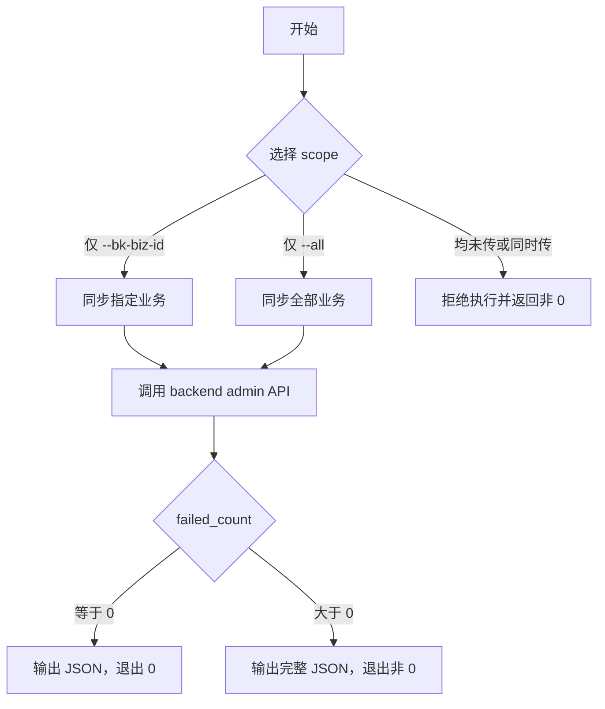

# Ops Scripts

`script_tools/ops` 提供运维快速入口。脚本只做参数校验、配置发现和命令包装，真正的鉴权、请求签名和接口调用由项目内置 CLI 或对应工具完成。

## 使用 admin 初始化租户

```bash
bk-nodemgr-adminclient backend tenant init --target-tenant-id example-tenant
```

该命令调用：

```text
bk-nodemgr-adminclient -> backend admin API
```

目标接口：`POST /admin/tenant/init`。

### Tenant 规则

`tenant init` 有两个不同的 tenant 语义：认证 tenant 和目标 tenant。

| 输入                 | 默认值   | 语义                                                               |
| -------------------- | -------- | ------------------------------------------------------------------ |
| Backend `tenantMode` | 配置决定 | 决定认证 tenant：`single` 使用 `default`，`multiple` 使用 `system` |
| `--login-name`       | `admin`  | 认证用户，写入 admin context                                       |
| `--target-tenant-id` | 无，必填 | 目标 tenant，作为接口 body 中的 `tenant_id` 传给 Backend           |

规则：

1. `--target-tenant-id` 必须显式传入；未传时 CLI 在创建 handler 前拒绝执行。
2. 认证 tenant 只能由 Backend 配置的 `tenantMode` 推导；CLI 不提供 `--tenant-id` 参数。
3. 当前 Backend `POST /admin/tenant/init` 只校验请求 body 可解析并返回成功，不执行租户数据写入或回填。



### Quick Start

使用默认配置和默认认证用户：

```bash
bk-nodemgr-adminclient backend tenant init \
  --target-tenant-id example-tenant
```

指定配置文件和认证用户：

```bash
bk-nodemgr-adminclient backend \
  -f /bk-nodemgr/etc/backend_conf.yaml \
  --login-name admin \
  tenant init \
  --target-tenant-id example-tenant
```

### 配置与连接

`bk-nodemgr-adminclient` 直接读取 Backend 配置，不使用脚本层配置发现。

1. `-f/--file` 默认读取 `/bk-nodemgr/etc/backend_conf.yaml`。
2. CLI 使用 `adminServer.advertiseIPV4` 和 `adminServer.port` 连接 Backend admin server。
3. `tenantMode` 决定认证 tenant：`single` 使用 `default`，`multiple` 使用 `system`。
4. `adminServer.jwtServerConfig.symmetricKey` 用于生成 admin 请求 JWT。

### 输出与退出码

成功时 stdout 输出：

```text
Successfully initialized tenant
```

退出码规则：

| 场景                                                      | 退出码 |
| --------------------------------------------------------- | ------ |
| 缺少 `--target-tenant-id`、配置文件读取失败、配置校验失败 | 非 0   |
| HTTP 调用失败或 backend admin API 返回 `code != 0`        | 非 0   |
| backend admin API 返回 `code == 0`                        | 0      |

## 同步未分配 Network Unit 的 Agent

```bash
./sync_unassigned_network_unit.sh (--bk-biz-id 2,3 | --all)
```

该脚本调用：

```text
sync_unassigned_network_unit.sh -> bk-nodemgr-adminclient -> backend admin API
```

目标接口：`POST /admin/node/agent/sync_unassigned_network_unit`。

### Scope 规则

必须显式选择一个 scope：

| 参数              | 语义             |
| ----------------- | ---------------- |
| `--bk-biz-id 2,3` | 只同步指定业务   |
| `--all`           | 显式同步全部业务 |

规则：

1. 未传 `--bk-biz-id` 且未传 `--all`：拒绝执行。
2. 同时传 `--bk-biz-id` 和 `--all`：拒绝执行。
3. `--all` 会触发全业务扫描，只在确认需要全量修复时使用。



### Quick Start

指定业务：

```bash
cd /bk-nodemgr/script/ops
./sync_unassigned_network_unit.sh --bk-biz-id 2,3
```

全业务：

```bash
cd /bk-nodemgr/script/ops
./sync_unassigned_network_unit.sh --all
```

指定配置文件和认证用户：

```bash
./sync_unassigned_network_unit.sh \
  -c /bk-nodemgr/etc/backend_conf.yaml \
  --login-name admin \
  --bk-biz-id 2
```

### 配置发现

未传 `-c/--config` 时，脚本只按以下顺序检查 backend 配置，避免误用其他服务的 `adminServer`：

1. `${CONF_DIR:-/bk-nodemgr/etc}/backend_conf.yaml`
2. `${CONF_DIR:-/bk-nodemgr/etc}/bk-nodemgr-backend.yml`

两个文件都不存在时拒绝执行。可通过 `CONF_DIR` 覆盖配置目录：

```bash
CONF_DIR=/data/bk-nodemgr/etc ./sync_unassigned_network_unit.sh --bk-biz-id 2
```

如果 `bk-nodemgr-adminclient` 不在默认路径 `/bk-nodemgr/bin/bk-nodemgr-adminclient` 或 `PATH` 中，可以指定：

```bash
ADMINCLIENT_BIN=/path/to/bk-nodemgr-adminclient ./sync_unassigned_network_unit.sh --bk-biz-id 2
```

### 输出与退出码

成功调用后，stdout 输出接口返回 JSON：

```json
{
  "success_count": 10,
  "failed_count": 0,
  "failed_reasons": []
}
```

退出码规则：

| 场景                                                                            | 退出码                  |
| ------------------------------------------------------------------------------- | ----------------------- |
| 参数错误、配置错误、找不到 `bk-nodemgr-adminclient`、传入不支持的 `--tenant-id` | 非 0                    |
| HTTP 调用失败或 backend admin API 返回错误                                      | 非 0                    |
| API 成功且 `failed_count == 0`                                                  | 0                       |
| API 成功但 `failed_count > 0`                                                   | 非 0，并仍输出完整 JSON |

`failed_count > 0` 表示部分 Host 未能完成同步，原因见 `failed_reasons`。
