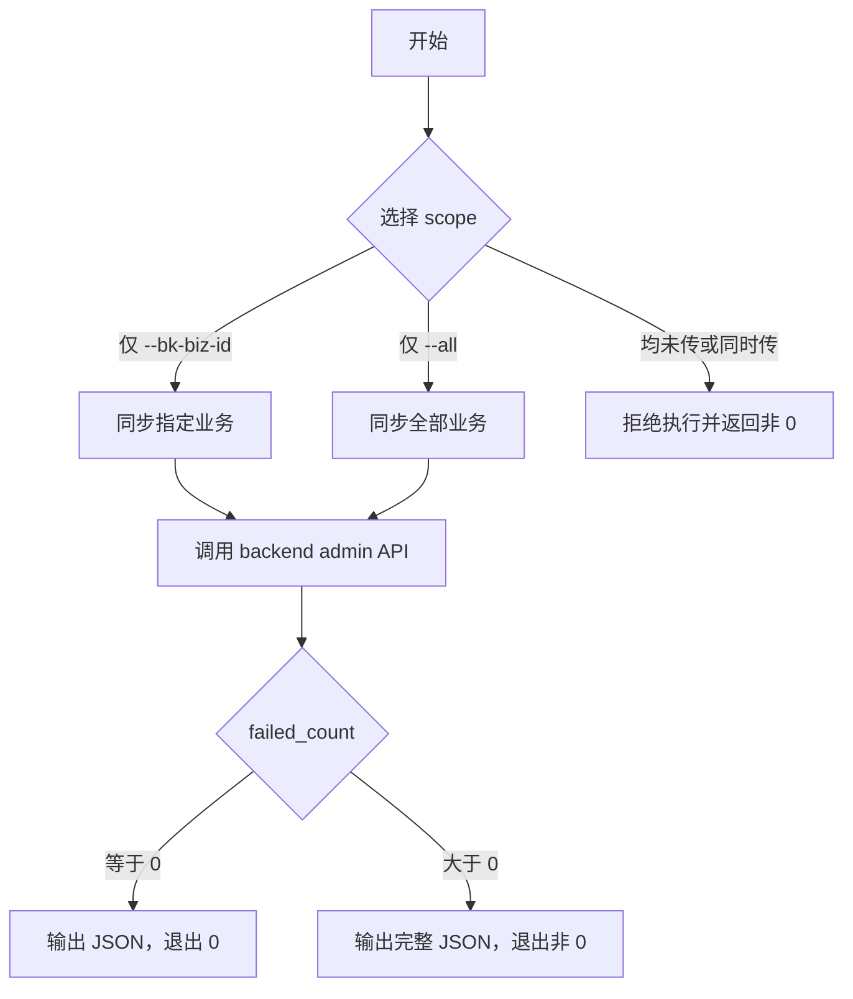

# Ops Scripts

`script_tools/ops` 提供运维快速入口。脚本只做参数校验、配置发现和命令包装，真正的鉴权、请求签名和接口调用由项目内置 CLI 或对应工具完成。

## 清理 Host legacy Zone ID

```bash
./mongo.sh remove-legacy-host-zone-id --tenant-id default
```

该命令连接当前 MongoDB，并只清理指定租户 Host collection 中旧格式的 `data.static.zone_id`：

```text
remove-legacy-host-zone-id --tenant-id default -> host_default -> unset string data.static.zone_id
```

### 适用场景

`data.static.zone_id` 已从 legacy string 迁移为 numeric host inventory 字段。上线新版本前，如果历史 Host 文档中仍存在 string 类型的 `data.static.zone_id`，新版本反序列化会失败。该命令用于在停写窗口内删除这些旧 string 值，让新版本后续按 CMDB 重新写入 numeric 值。

命令只匹配 BSON string：

```javascript
{ "data.static.zone_id": { $type: "string" } }
```

已经是 numeric 的 `data.static.zone_id` 不会被清理。

### Quick Start

指定配置文件：

```bash
cd /bk-nodemgr/script/ops
./mongo.sh \
  -c /bk-nodemgr/etc/backend_conf.yaml \
  remove-legacy-host-zone-id \
  --tenant-id default
```

使用默认配置发现：

```bash
./mongo.sh remove-legacy-host-zone-id --tenant-id default
```

### 执行前置条件

1. 先备份 MongoDB。
2. 暂停或停止会写入 Host inventory 的进程。
3. 按租户逐个执行命令。
4. 确认输出中的 `Legacy string zone_id documents after cleanup: 0`。
5. 再部署会写入 numeric `data.static.zone_id` 的新版本。

### 输出与退出码

命令会输出清理前 legacy string 文档数、Mongo 更新结果和清理后 legacy string 文档数：

```text
Legacy string zone_id documents before cleanup: 10
Matched documents: 10
Modified documents: 10
Legacy string zone_id documents after cleanup: 0
```

退出码规则：

| 场景 | 退出码 |
| --- | --- |
| 参数错误、配置错误、租户 ID 不合法、Host collection 不存在 | 非 0 |
| Mongo 执行失败 | 非 0 |
| 清理后仍存在 string `data.static.zone_id` | 非 0 |
| 清理成功或没有 legacy string 文档需要清理 | 0 |

## 同步未分配 Network Unit 的 Agent

```bash
./sync_unassigned_network_unit.sh (--bk-biz-id 2,3 | --all)
```

该脚本调用：

```text
sync_unassigned_network_unit.sh -> bk-nodemgr-adminclient -> backend admin API
```

目标接口：`POST /admin/node/agent/sync_unassigned_network_unit`。

### Scope 规则

必须显式选择一个 scope：

| 参数 | 语义 |
| --- | --- |
| `--bk-biz-id 2,3` | 只同步指定业务 |
| `--all` | 显式同步全部业务 |

规则：

1. 未传 `--bk-biz-id` 且未传 `--all`：拒绝执行。
2. 同时传 `--bk-biz-id` 和 `--all`：拒绝执行。
3. `--all` 会触发全业务扫描，只在确认需要全量修复时使用。



### Quick Start

指定业务：

```bash
cd /bk-nodemgr/script/ops
./sync_unassigned_network_unit.sh --bk-biz-id 2,3
```

全业务：

```bash
cd /bk-nodemgr/script/ops
./sync_unassigned_network_unit.sh --all
```

指定配置文件和认证身份：

```bash
./sync_unassigned_network_unit.sh \
  -c /bk-nodemgr/etc/backend_conf.yaml \
  --tenant-id default \
  --login-name admin \
  --bk-biz-id 2
```

### 配置发现

未传 `-c/--config` 时，脚本只按以下顺序检查 backend 配置，避免误用其他服务的 `adminServer`：

1. `${CONF_DIR:-/bk-nodemgr/etc}/backend_conf.yaml`
2. `${CONF_DIR:-/bk-nodemgr/etc}/bk-nodemgr-backend.yml`

两个文件都不存在时拒绝执行。可通过 `CONF_DIR` 覆盖配置目录：

```bash
CONF_DIR=/data/bk-nodemgr/etc ./sync_unassigned_network_unit.sh --bk-biz-id 2
```

如果 `bk-nodemgr-adminclient` 不在默认路径 `/bk-nodemgr/bin/bk-nodemgr-adminclient` 或 `PATH` 中，可以指定：

```bash
ADMINCLIENT_BIN=/path/to/bk-nodemgr-adminclient ./sync_unassigned_network_unit.sh --bk-biz-id 2
```

### 输出与退出码

成功调用后，stdout 输出接口返回 JSON：

```json
{
  "success_count": 10,
  "failed_count": 0,
  "failed_reasons": []
}
```

退出码规则：

| 场景 | 退出码 |
| --- | --- |
| 参数错误、配置错误、找不到 `bk-nodemgr-adminclient` | 非 0 |
| HTTP 调用失败或 backend admin API 返回错误 | 非 0 |
| API 成功且 `failed_count == 0` | 0 |
| API 成功但 `failed_count > 0` | 非 0，并仍输出完整 JSON |

`failed_count > 0` 表示部分 Host 未能完成同步，原因见 `failed_reasons`。
