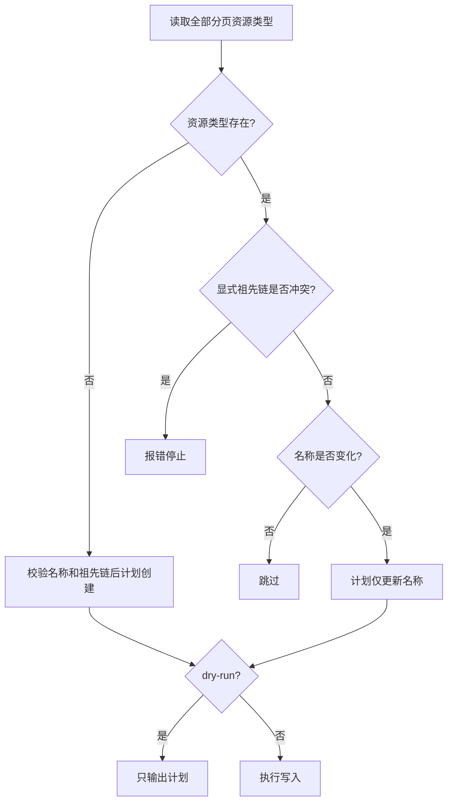

# IAM V4 权限模型迁移文件

本目录存放 bk-nodemgr 的 IAM V4 权限模型模板、渲染工具和迁移工具。

使用流程：配置变量 → 渲染模板 → 预检查 → 执行迁移。支持 `upsert_system` 和 `upsert_resource_type`：不存在时注册，已存在时有限更新；暂不处理操作、角色和授权。

## 文件说明

| 文件                | 说明                                           |
| ------------------- | ---------------------------------------------- |
| `templates/`        | V4 System 与四类本地 ResourceType 模板         |
| `vars.yaml.example` | 变量配置示例                                   |
| `render/`           | 渲染工具源码，构建后生成 `render/iam-render`   |
| `migrate/`          | 迁移工具源码，构建后生成 `migrate/iam-migrate` |

V4 工具独立维护，不修改 V3 工具。运行时不依赖 `bk-cli`。

## 使用方法

### 1. 构建工具并准备变量

以下步骤在 `support-files/bkiamv4` 目录执行，构建需要项目要求的 Go 环境。

```bash
cd support-files/bkiamv4
make -C render build
make -C migrate build
cp vars.yaml.example vars.yaml
```

按下方「变量配置」填写 `vars.yaml`。示例中的回调地址需替换为实际部署地址，不要将应用密钥写入变量文件或模板。

### 2. 渲染模板

```bash
./render/iam-render -t templates -v vars.yaml -o output
```

渲染 `templates/` 目录下所有 `.tpl` 文件，输出到 `output/`，文件名去掉 `.tpl` 后缀。当前生成 `0001_bk_nodemgr_system.json` 和 `0002_bk_nodemgr_resource_type.json`，执行迁移前检查两个文件。

### 3. 预检查

通过本地环境或部署平台注入 `BK_APP_SECRET`，再执行：

```bash
./migrate/iam-migrate \
  --gateway-url "https://bkapi.example.com/api/bkiam/prod/" \
  --app-code "bk-nodemgr" \
  --tenant-id "example-tenant" \
  --dir output \
  --dry-run
```

将网关地址、应用编码和租户 ID 替换为实际值。`--dry-run` 会校验文件并查询远端模型，输出创建、更新或跳过计划，**不会写入远端**。因此预检查也需要网络和有效的应用认证。

### 4. 执行迁移

确认目标环境、租户和预检查结果后，去掉 `--dry-run`：

```bash
./migrate/iam-migrate \
  --gateway-url "https://bkapi.example.com/api/bkiam/prod/" \
  --app-code "bk-nodemgr" \
  --tenant-id "example-tenant" \
  --dir output
```

该命令直接执行，不会再次询问确认。如只执行一个文件，将 `--dir output` 替换为 `--file output/0001_bk_nodemgr_system.json`，两者不能同时使用。

## 变量配置

变量由 `vars.yaml` 提供，示例值不是工具自动补充的默认值。

| 变量路径              | 说明                                                        | 示例值                                                  |
| --------------------- | ----------------------------------------------------------- | ------------------------------------------------------- |
| `system.id`           | IAM 系统标识，不是应用编码                                  | `bk_nodemgr`                                            |
| `system.name`         | 系统显示名称                                                | `BlueKing Node Manager`                                 |
| `system.description`  | 系统说明                                                    | 节点管理系统的功能说明                                  |
| `system.clients`      | 可调用该系统的应用编码数组，必须包含本次调用的 `--app-code` | `["bk-nodemgr"]`                                        |
| `system.callback_url` | IAM 可访问的 V4 资源回调完整地址                            | `https://bk-nodemgr.example.com/api/v3/iam/v4/resource` |

注意区分 `bk_nodemgr`（system ID）和 `bk-nodemgr`（app code）。默认模板不包含可选字段 `managers`；如需设置，应在模板的 `data` 中显式添加字符串数组。

## 迁移参数

| 参数            | 说明                                                             |
| --------------- | ---------------------------------------------------------------- |
| `--gateway-url` | 完整网关入口，包含网关名 `bkiam` 和 stage，如 `/api/bkiam/prod/` |
| `--app-code`    | 调用应用编码，必填                                               |
| `--app-secret`  | 调用应用密钥；未传时读取 `BK_APP_SECRET`，两者不能都为空         |
| `--tenant-id`   | 目标租户 ID，必填；不是环境名称，单次只处理一个租户              |
| `--file`        | 单个已渲染 JSON 文件，与 `--dir` 二选一                          |
| `--dir`         | 已渲染 JSON 文件目录，与 `--file` 二选一                         |
| `--dry-run`     | 只查询和输出计划，不写入                                         |

建议通过 `BK_APP_SECRET` 提供密钥，避免在命令历史和进程参数中留下明文。显式传入的 `--app-secret` 优先，即使传入空字符串也不会回退到环境变量。

## 模板与更新规则

模板使用 Go template 语法，通过 `toJson` 输出 JSON 字符串或数组，避免引号和换行破坏 JSON：

```gotemplate
"name": {{ .system.name | toJson }},
"clients": {{ .system.clients | toJson }}
```

迁移文件通过 `system_id` 指定系统，`operations` 中每项包含 `operation` 和 `data`。`upsert_system` 的 `data.id` 必须与 `system_id` 一致；`upsert_resource_type` 的 `data.id` 是该系统内的资源类型 ID。

| 场景                                         | 处理方式                                        |
| -------------------------------------------- | ----------------------------------------------- |
| 查询明确返回 HTTP 404 且错误码为 `NOT_FOUND` | 创建 system，要求提供 `id`、`name` 和 `clients` |
| system 已存在                                | 更新显式提供的可变字段，不发送不可变的 `id`     |
| 更新时未提供某字段                           | 保留远端值，不自动清空                          |
| 显式提供数组                                 | 整体替换，不与远端数组合并                      |
| 显式提供空字符串或空数组                     | 按原值提交，但仍须满足本地校验和 IAM 接口约束   |
| 提供 `clients` 但不包含调用应用              | 本地报错，防止更新后失去管理权限；不会自动追加  |

目录模式仅选择 `<数字>_*.json`，按数字序号排序；序号相同则按文件名排序。每个文件内按 `operations` 顺序执行。dry-run 会将同一 system 前面计划的创建纳入后续判断，不重复计划创建。

### ResourceType 更新规则

`0002` 模板按父资源在先的顺序注册 `networkarea`、`networkunit`、`package_type`、`package`，保留 `networkarea → networkunit` 和 `package_type → package` 两条关系，不注册 `biz`。

`data` 仅接受 `id`、`name`、`ancestors`。ID 最长 32 字符，以小写字母开头，只含小写字母、数字、`_`、`-`；`ancestors` 为从根到直接父级的 ID 数组，不得重复或包含自身。

| 场景                                     | 处理方式                                                                   |
| ---------------------------------------- | -------------------------------------------------------------------------- |
| 资源类型不存在                           | 要求 `name`，通过批量创建接口提交单元素数组；省略 `ancestors` 表示顶层资源 |
| 资源类型已存在，未提供 `ancestors`       | 保留远端祖先链                                                             |
| 显式祖先链与远端不一致，包括用 `[]` 清空 | 报错停止，不自动改拓扑或删除重建                                           |
| 名称改变                                 | 只更新 `name`，不发送 `id` 或 `ancestors`                                  |
| 名称未提供或相同，拓扑一致               | 跳过写入                                                                   |
| 祖先尚未存在、祖先链不一致或名称冲突     | 报错停止；先创建祖先，再创建子资源                                         |

IAM API 允许受限修改祖先链，但会受后代资源类型、角色和已有授权约束；本工具有意不自动执行这类变更。



每个系统的资源类型列表按 `page_size=100` 读取全部分页；失败或不完整响应不会被当作空列表。dry-run 中，前面计划新建的 System 使用虚拟空列表，计划新建的 ResourceType 对后续子资源可见，不请求尚不存在的系统。单独执行 `0002` 时，System 必须已存在。dry-run 不验证服务端全部约束，也不保证后续执行期间远端状态不变。

## 失败处理

- 所有选中文件先完成本地校验，再访问远端。未知字段、未知 operation、`null` 字段值或不一致的 system ID 都会报错。
- 认证失败、超时、异常响应等错误不会被当成「系统不存在」，也不会触发创建。
- 单次 HTTP 请求超时为 30 秒，不跟随重定向，不自动重试写入。
- 任一步骤失败即停止，已成功的操作不会回滚。写入中断或失败后，先检查远端状态，再决定是否重跑。
- 执行计划输出到 stdout，诊断信息输出到 stderr；失败时返回非零退出码。
